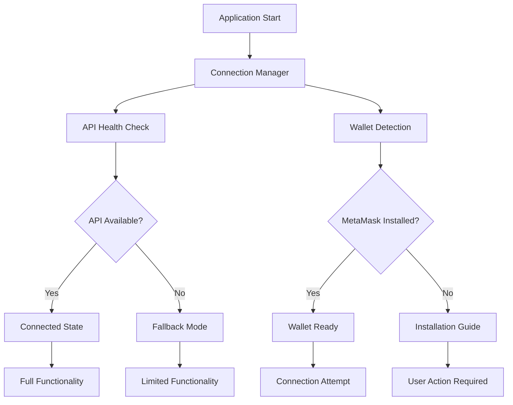
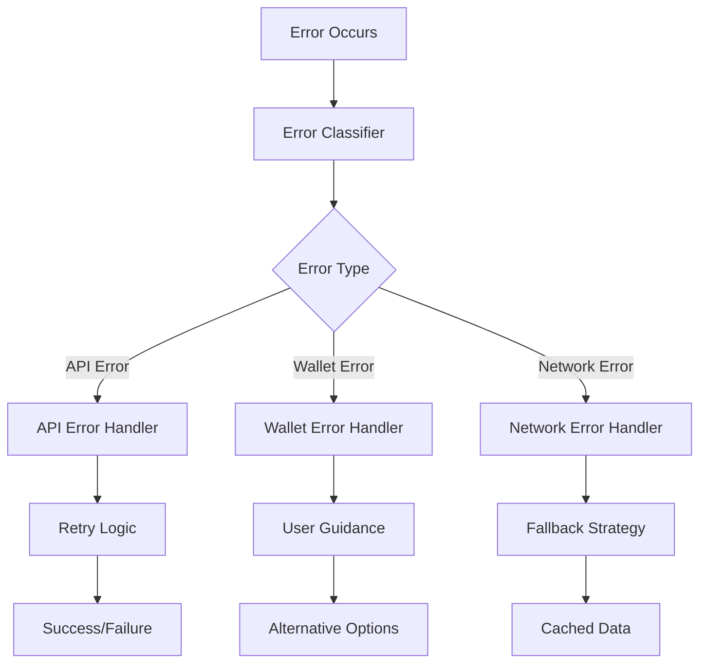

# Design Document

## Overview

This design document outlines the solution for fixing critical connection issues in the SeiMoney frontend application. The primary issues are malformed API URLs causing health check failures and MetaMask connection errors. The design focuses on robust error handling, proper URL construction, and comprehensive connection management.

## Architecture

### Connection Management System



### Error Flow Architecture



## Components and Interfaces

### 1. API Client Fix

**Current Issue Analysis:**
The error shows malformed URL: `http://localhost:3001/health/health:3001/health/health:1`
This indicates URL path duplication and port number insertion in wrong places.

**Fixed Interface:**
```typescript
interface ApiClient {
  baseURL: string;
  timeout: number;
  retryAttempts: number;
  
  // Fixed methods
  request<T>(endpoint: string, options?: RequestOptions): Promise<T>;
  get<T>(endpoint: string): Promise<T>;
  post<T>(endpoint: string, data?: any): Promise<T>;
  
  // Health check with proper URL construction
  checkHealth(): Promise<HealthStatus>;
}

interface HealthStatus {
  status: 'connected' | 'disconnected' | 'error';
  message: string;
  timestamp: number;
  retryAfter?: number;
}
```

**Implementation Strategy:**
```typescript
class FixedApiClient {
  private baseURL: string;
  
  constructor(baseURL: string) {
    // Ensure baseURL doesn't end with slash
    this.baseURL = baseURL.replace(/\/$/, '');
  }
  
  private buildURL(endpoint: string): string {
    // Ensure endpoint starts with slash
    const cleanEndpoint = endpoint.startsWith('/') ? endpoint : `/${endpoint}`;
    return `${this.baseURL}${cleanEndpoint}`;
  }
  
  async checkHealth(): Promise<HealthStatus> {
    try {
      const url = this.buildURL('/health');
      const response = await fetch(url, {
        method: 'GET',
        timeout: 5000
      });
      
      if (response.ok) {
        return {
          status: 'connected',
          message: 'Backend is healthy',
          timestamp: Date.now()
        };
      } else {
        throw new Error(`HTTP ${response.status}: ${response.statusText}`);
      }
    } catch (error) {
      return {
        status: 'error',
        message: error.message,
        timestamp: Date.now(),
        retryAfter: 5000
      };
    }
  }
}
```

### 2. MetaMask Connection System

**Current Issue Analysis:**
Error shows "MetaMask extension not found" which indicates the detection logic is failing.

**Enhanced Interface:**
```typescript
interface WalletConnectionManager {
  detectMetaMask(): Promise<boolean>;
  connectWallet(): Promise<WalletConnection>;
  handleConnectionError(error: Error): ConnectionErrorResponse;
  getInstallationGuide(): InstallationGuide;
}

interface WalletConnection {
  isConnected: boolean;
  address?: string;
  provider: string;
  error?: string;
}

interface ConnectionErrorResponse {
  type: 'not_installed' | 'user_rejected' | 'network_error' | 'unknown';
  message: string;
  actionRequired: string;
  helpLink?: string;
}

interface InstallationGuide {
  title: string;
  steps: string[];
  downloadLink: string;
  supportedBrowsers: string[];
}
```

**Implementation Strategy:**
```typescript
class MetaMaskConnectionManager {
  async detectMetaMask(): Promise<boolean> {
    // Multiple detection methods
    if (typeof window === 'undefined') return false;
    
    // Method 1: Check window.ethereum
    if (window.ethereum?.isMetaMask) return true;
    
    // Method 2: Check for MetaMask provider
    if (window.ethereum?.providers?.some(p => p.isMetaMask)) return true;
    
    // Method 3: Wait for provider injection (up to 3 seconds)
    return new Promise((resolve) => {
      let attempts = 0;
      const maxAttempts = 30; // 3 seconds with 100ms intervals
      
      const checkProvider = () => {
        if (window.ethereum?.isMetaMask) {
          resolve(true);
          return;
        }
        
        attempts++;
        if (attempts < maxAttempts) {
          setTimeout(checkProvider, 100);
        } else {
          resolve(false);
        }
      };
      
      checkProvider();
    });
  }
  
  async connectWallet(): Promise<WalletConnection> {
    try {
      const isInstalled = await this.detectMetaMask();
      
      if (!isInstalled) {
        return {
          isConnected: false,
          provider: 'metamask',
          error: 'MetaMask not installed'
        };
      }
      
      const accounts = await window.ethereum.request({
        method: 'eth_requestAccounts'
      });
      
      if (accounts.length === 0) {
        throw new Error('No accounts available');
      }
      
      return {
        isConnected: true,
        address: accounts[0],
        provider: 'metamask'
      };
      
    } catch (error) {
      return {
        isConnected: false,
        provider: 'metamask',
        error: error.message
      };
    }
  }
  
  handleConnectionError(error: Error): ConnectionErrorResponse {
    if (error.message.includes('not installed') || error.message.includes('not found')) {
      return {
        type: 'not_installed',
        message: 'MetaMask extension is not installed in your browser.',
        actionRequired: 'Please install MetaMask extension and refresh the page.',
        helpLink: 'https://metamask.io/download/'
      };
    }
    
    if (error.message.includes('rejected') || error.message.includes('denied')) {
      return {
        type: 'user_rejected',
        message: 'Connection request was rejected.',
        actionRequired: 'Please try connecting again and approve the connection request.'
      };
    }
    
    return {
      type: 'unknown',
      message: 'An unexpected error occurred while connecting to MetaMask.',
      actionRequired: 'Please refresh the page and try again.'
    };
  }
}
```

### 3. Connection Status Component

**Interface:**
```typescript
interface ConnectionStatusProps {
  apiStatus: HealthStatus;
  walletStatus: WalletConnection;
  onRetryApi: () => void;
  onRetryWallet: () => void;
}

interface ConnectionIndicator {
  status: 'connected' | 'disconnected' | 'error' | 'loading';
  label: string;
  message: string;
  actionButton?: {
    text: string;
    onClick: () => void;
  };
}
```

**Implementation Strategy:**
```typescript
const ConnectionStatus: React.FC<ConnectionStatusProps> = ({
  apiStatus,
  walletStatus,
  onRetryApi,
  onRetryWallet
}) => {
  const getApiIndicator = (): ConnectionIndicator => {
    switch (apiStatus.status) {
      case 'connected':
        return {
          status: 'connected',
          label: 'Backend',
          message: 'Connected to SeiMoney API'
        };
      case 'disconnected':
        return {
          status: 'disconnected',
          label: 'Backend',
          message: 'Backend is unavailable',
          actionButton: {
            text: 'Retry',
            onClick: onRetryApi
          }
        };
      case 'error':
        return {
          status: 'error',
          label: 'Backend',
          message: apiStatus.message,
          actionButton: {
            text: 'Retry',
            onClick: onRetryApi
          }
        };
    }
  };
  
  const getWalletIndicator = (): ConnectionIndicator => {
    if (walletStatus.isConnected) {
      return {
        status: 'connected',
        label: 'Wallet',
        message: `Connected: ${walletStatus.address?.slice(0, 6)}...${walletStatus.address?.slice(-4)}`
      };
    }
    
    if (walletStatus.error?.includes('not installed')) {
      return {
        status: 'error',
        label: 'Wallet',
        message: 'MetaMask not installed',
        actionButton: {
          text: 'Install MetaMask',
          onClick: () => window.open('https://metamask.io/download/', '_blank')
        }
      };
    }
    
    return {
      status: 'disconnected',
      label: 'Wallet',
      message: 'Wallet not connected',
      actionButton: {
        text: 'Connect',
        onClick: onRetryWallet
      }
    };
  };
  
  // Component render logic...
};
```

## Data Models

### Error Classification Model
```typescript
interface ErrorClassification {
  category: 'api' | 'wallet' | 'network' | 'validation';
  severity: 'low' | 'medium' | 'high' | 'critical';
  code: string;
  message: string;
  userMessage: string;
  actionRequired: boolean;
  retryable: boolean;
  fallbackAvailable: boolean;
}
```

### Connection State Model
```typescript
interface ConnectionState {
  api: {
    status: 'connected' | 'disconnected' | 'error' | 'loading';
    lastCheck: number;
    retryCount: number;
    error?: string;
  };
  wallet: {
    status: 'connected' | 'disconnected' | 'error' | 'not_installed';
    provider?: string;
    address?: string;
    error?: string;
  };
  fallbackMode: boolean;
  lastUpdate: number;
}
```

## Error Handling

### Comprehensive Error Handling Strategy

1. **API Errors**
   - URL malformation detection and correction
   - Network timeout handling with exponential backoff
   - HTTP status code specific responses
   - Fallback to cached data when available

2. **Wallet Errors**
   - Extension detection with multiple methods
   - User rejection handling with retry options
   - Network switching guidance
   - Alternative wallet suggestions

3. **Recovery Mechanisms**
   - Automatic retry with intelligent backoff
   - Manual retry buttons with clear feedback
   - Fallback functionality when services are unavailable
   - Clear user guidance for resolution steps

### Error Recovery Flow
```typescript
class ErrorRecoveryManager {
  async handleApiError(error: ApiError): Promise<RecoveryResult> {
    // Log error for debugging
    console.error('API Error:', error);
    
    // Attempt URL correction if malformed
    if (error.type === 'malformed_url') {
      const correctedClient = new FixedApiClient(this.baseURL);
      return await this.retryWithCorrectedClient(correctedClient);
    }
    
    // Implement exponential backoff for network errors
    if (error.type === 'network_error') {
      return await this.retryWithBackoff(error.retryCount);
    }
    
    // Enable fallback mode for persistent errors
    if (error.retryCount > 3) {
      return this.enableFallbackMode();
    }
    
    return { success: false, fallbackEnabled: false };
  }
  
  async handleWalletError(error: WalletError): Promise<RecoveryResult> {
    switch (error.type) {
      case 'not_installed':
        return this.showInstallationGuide();
      case 'user_rejected':
        return this.showRetryOption();
      case 'network_error':
        return this.showNetworkGuidance();
      default:
        return this.showGenericError();
    }
  }
}
```

## Testing Strategy

### Unit Testing
- Test URL construction and validation
- Test MetaMask detection methods
- Test error classification and handling
- Test retry logic and backoff algorithms

### Integration Testing
- Test API client with real backend
- Test wallet connection with MetaMask extension
- Test error scenarios with network failures
- Test fallback mode functionality

### User Acceptance Testing
- Test with MetaMask installed and uninstalled
- Test with backend available and unavailable
- Test error recovery flows
- Test user guidance effectiveness

## Performance Optimization

### Connection Optimization
- Implement connection pooling for API requests
- Use intelligent retry timing to avoid overwhelming services
- Cache connection status to reduce redundant checks
- Implement lazy loading for non-critical connection checks

### User Experience Optimization
- Show immediate feedback for all user actions
- Implement loading states for connection attempts
- Provide clear progress indicators during retry attempts
- Use optimistic UI updates where appropriate

## Security Considerations

### API Security
- Validate all API URLs before making requests
- Implement proper timeout handling to prevent hanging requests
- Use secure HTTP headers for all API communications
- Validate API responses before processing

### Wallet Security
- Never store private keys or sensitive wallet data
- Validate wallet addresses before using them
- Implement proper session management for wallet connections
- Handle wallet disconnection events properly

## Monitoring and Analytics

### Connection Monitoring
- Track API connection success/failure rates
- Monitor wallet connection success rates by browser
- Track error types and frequencies
- Monitor retry attempt success rates

### User Experience Monitoring
- Track time to successful connection
- Monitor user drop-off during connection process
- Track effectiveness of error messages and guidance
- Monitor fallback mode usage patterns