# Design Document

## Overview

The End-to-End User Journey Testing system is designed to provide comprehensive validation of the SeiMoney DeFi platform integration. This system will create a structured testing framework that simulates real user interactions across all major platform features (payments, groups, pots, vaults) and validates that data flows correctly between the frontend React application, backend API services, and smart contracts on the Sei blockchain.

The design focuses on creating a seamless testing experience that can be executed manually for demos or automated for continuous integration, ensuring that all components work together as a cohesive platform.

## Architecture

### System Components

```mermaid
graph TB
    subgraph "Testing Framework"
        TEST_RUNNER[🎯 Test Runner<br/>Orchestrates test execution]
        DATA_VALIDATOR[✅ Data Validator<br/>Validates cross-component consistency]
        SCENARIO_ENGINE[🎬 Scenario Engine<br/>Executes user scenarios]
        REPORT_GEN[📊 Report Generator<br/>Creates test reports]
    end
    
    subgraph "Frontend Testing Layer"
        UI_AUTOMATION[🖱️ UI Automation<br/>Simulates user interactions]
        STATE_MONITOR[📊 State Monitor<br/>Tracks React state changes]
        API_INTERCEPTOR[🔍 API Interceptor<br/>Monitors API calls]
    end
    
    subgraph "Backend Testing Layer"
        API_TESTER[🔧 API Tester<br/>Direct API validation]
        DB_VALIDATOR[🗄️ Database Validator<br/>Checks data persistence]
        CONTRACT_MONITOR[⛓️ Contract Monitor<br/>Validates blockchain state]
    end
    
    subgraph "Data Flow Validation"
        CONSISTENCY_CHECKER[🔄 Consistency Checker<br/>Cross-layer validation]
        REAL_TIME_MONITOR[⚡ Real-time Monitor<br/>Live data updates]
        INTEGRATION_VALIDATOR[🔗 Integration Validator<br/>End-to-end flows]
    end
    
    TEST_RUNNER --> UI_AUTOMATION
    TEST_RUNNER --> API_TESTER
    TEST_RUNNER --> SCENARIO_ENGINE
    
    UI_AUTOMATION --> STATE_MONITOR
    UI_AUTOMATION --> API_INTERCEPTOR
    
    API_TESTER --> DB_VALIDATOR
    API_TESTER --> CONTRACT_MONITOR
    
    DATA_VALIDATOR --> CONSISTENCY_CHECKER
    DATA_VALIDATOR --> REAL_TIME_MONITOR
    DATA_VALIDATOR --> INTEGRATION_VALIDATOR
    
    SCENARIO_ENGINE --> REPORT_GEN
```



### Testing Architecture Layers

1. **Presentation Layer Testing**: Validates React components, user interactions, and UI state management
2. **API Layer Testing**: Tests backend endpoints, request/response validation, and error handling
3. **Service Layer Testing**: Validates business logic, data processing, and external integrations
4. **Data Layer Testing**: Checks database operations, caching, and data consistency
5. **Blockchain Layer Testing**: Validates smart contract interactions and blockchain state

## Components and Interfaces

### Test Runner Component

```typescript
interface TestRunner {
  // Core execution methods
  executeScenario(scenario: TestScenario): Promise<TestResult>;
  executeFullSuite(): Promise<TestSuiteResult>;
  
  // Configuration and setup
  configure(config: TestConfig): void;
  setupEnvironment(): Promise<void>;
  teardownEnvironment(): Promise<void>;
  
  // Monitoring and reporting
  getExecutionStatus(): TestExecutionStatus;
  generateReport(): TestReport;
}

interface TestScenario {
  id: string;
  name: string;
  description: string;
  steps: TestStep[];
  expectedOutcomes: ExpectedOutcome[];
  timeout: number;
  retryCount: number;
}

interface TestStep {
  id: string;
  type: 'ui_interaction' | 'api_call' | 'validation' | 'wait';
  action: string;
  parameters: Record<string, any>;
  expectedResult?: any;
  validations: Validation[];
}
```

### UI Automation Component

```typescript
interface UIAutomation {
  // Navigation and interaction
  navigateToPage(page: string): Promise<void>;
  fillForm(formData: FormData): Promise<void>;
  clickButton(selector: string): Promise<void>;
  waitForElement(selector: string, timeout?: number): Promise<void>;
  
  // State monitoring
  getComponentState(component: string): Promise<any>;
  waitForStateChange(component: string, expectedState: any): Promise<void>;
  
  // Data validation
  validateDisplayedData(selector: string, expectedData: any): Promise<boolean>;
  captureScreenshot(name: string): Promise<string>;
}

interface FormData {
  payments: {
    recipient: string;
    amount: number;
    remark: string;
    expiryDate: string;
  };
  groups: {
    name: string;
    description: string;
    targetAmount: number;
    type: string;
  };
  pots: {
    name: string;
    targetAmount: number;
    targetDate: string;
    description: string;
    initialDeposit?: number;
  };
  vaults: {
    name: string;
    strategy: string;
    initialDeposit: number;
    lockPeriod: number;
  };
}
```

### Data Validator Component

```typescript
interface DataValidator {
  // Cross-component validation
  validateDataConsistency(entityType: string, entityId: string): Promise<ValidationResult>;
  validateRealTimeUpdates(component: string): Promise<ValidationResult>;
  
  // Specific validations
  validateTransferFlow(transferId: string): Promise<TransferValidation>;
  validateGroupFlow(groupId: string): Promise<GroupValidation>;
  validatePotFlow(potId: string): Promise<PotValidation>;
  validateVaultFlow(vaultId: string): Promise<VaultValidation>;
  
  // Dashboard validation
  validateDashboardData(): Promise<DashboardValidation>;
  validatePortfolioCalculations(): Promise<PortfolioValidation>;
}

interface ValidationResult {
  isValid: boolean;
  errors: ValidationError[];
  warnings: ValidationWarning[];
  timestamp: string;
  executionTime: number;
}
```

### Scenario Engine Component

```typescript
interface ScenarioEngine {
  // Scenario execution
  executePaymentScenario(config: PaymentScenarioConfig): Promise<ScenarioResult>;
  executeGroupScenario(config: GroupScenarioConfig): Promise<ScenarioResult>;
  executePotScenario(config: PotScenarioConfig): Promise<ScenarioResult>;
  executeVaultScenario(config: VaultScenarioConfig): Promise<ScenarioResult>;
  executeDashboardScenario(): Promise<ScenarioResult>;
  
  // Comprehensive scenarios
  executeFullUserJourney(): Promise<UserJourneyResult>;
  executeDemoScenario(): Promise<DemoResult>;
}

interface ScenarioResult {
  scenarioId: string;
  success: boolean;
  executionTime: number;
  steps: StepResult[];
  dataValidations: ValidationResult[];
  screenshots: string[];
  errors: Error[];
}
```

## Data Models

### Test Configuration Model

```typescript
interface TestConfig {
  environment: {
    frontendUrl: string;
    backendUrl: string;
    blockchainNetwork: string;
    testWalletAddress: string;
    testWalletPrivateKey: string;
  };
  
  scenarios: {
    payments: PaymentTestConfig;
    groups: GroupTestConfig;
    pots: PotTestConfig;
    vaults: VaultTestConfig;
    dashboard: DashboardTestConfig;
  };
  
  validation: {
    timeouts: {
      uiInteraction: number;
      apiCall: number;
      blockchainConfirmation: number;
      dataConsistency: number;
    };
    retryAttempts: number;
    screenshotOnFailure: boolean;
  };
  
  reporting: {
    outputFormat: 'html' | 'json' | 'junit';
    includeScreenshots: boolean;
    includeDetailedLogs: boolean;
  };
}
```

### Test Data Models

```typescript
interface TestTransfer {
  recipient: string;
  amount: number;
  remark: string;
  expiryDate: string;
  expectedStatus: 'pending' | 'completed' | 'expired';
}

interface TestGroup {
  name: string;
  description: string;
  targetAmount: number;
  type: 'savings' | 'investment' | 'charity';
  expectedMembers: number;
}

interface TestPot {
  name: string;
  targetAmount: number;
  targetDate: string;
  description: string;
  initialDeposit: number;
  expectedProgress: number;
}

interface TestVault {
  name: string;
  strategy: 'yield-farming' | 'liquidity-provision' | 'staking';
  initialDeposit: number;
  lockPeriod: number;
  expectedApr: number;
}
```

### Validation Models

```typescript
interface CrossComponentValidation {
  frontend: {
    displayedData: any;
    componentState: any;
    uiElements: UIElementState[];
  };
  
  backend: {
    apiResponse: any;
    databaseState: any;
    cacheState: any;
  };
  
  blockchain: {
    contractState: any;
    transactionHash: string;
    blockHeight: number;
  };
  
  consistency: {
    dataMatches: boolean;
    discrepancies: Discrepancy[];
    lastSyncTime: string;
  };
}
```

## Error Handling

### Error Classification System

```typescript
enum ErrorType {
  UI_INTERACTION_FAILED = 'ui_interaction_failed',
  API_CALL_FAILED = 'api_call_failed',
  DATA_VALIDATION_FAILED = 'data_validation_failed',
  BLOCKCHAIN_INTERACTION_FAILED = 'blockchain_interaction_failed',
  TIMEOUT_EXCEEDED = 'timeout_exceeded',
  ASSERTION_FAILED = 'assertion_failed',
  ENVIRONMENT_SETUP_FAILED = 'environment_setup_failed'
}

interface TestError {
  type: ErrorType;
  message: string;
  details: any;
  timestamp: string;
  step: string;
  screenshot?: string;
  stackTrace?: string;
  retryable: boolean;
}
```

### Error Recovery Strategies

1. **Automatic Retry**: For transient failures (network issues, temporary UI states)
2. **Environment Reset**: For environment-related issues (wallet connection, network problems)
3. **Graceful Degradation**: Continue testing other components when one fails
4. **Detailed Logging**: Capture comprehensive error context for debugging
5. **Screenshot Capture**: Visual evidence of failure states

### Debugging Support

```typescript
interface DebugSupport {
  // Environment diagnostics
  checkWalletConnection(): Promise<ConnectionStatus>;
  checkBackendHealth(): Promise<HealthStatus>;
  checkBlockchainConnection(): Promise<BlockchainStatus>;
  
  // Data diagnostics
  dumpComponentState(component: string): Promise<any>;
  dumpDatabaseState(table: string): Promise<any>;
  dumpContractState(contract: string): Promise<any>;
  
  // Log management
  enableDetailedLogging(): void;
  captureNetworkTraffic(): void;
  generateDiagnosticReport(): Promise<DiagnosticReport>;
}
```

## Testing Strategy

### Test Execution Flow


### Test Scenarios

#### 1. Payment Transfer Scenario
- Create multiple transfers with different parameters
- Validate transfer appears in "My Transfers" list
- Verify backend database consistency
- Check smart contract state updates
- Validate dashboard portfolio updates

#### 2. Group Management Scenario
- Create groups with various configurations
- Validate group creation in UI and backend
- Test contribution functionality
- Verify group statistics and member management
- Check dashboard group metrics

#### 3. Savings Pot Scenario
- Create pots with different targets and dates
- Make initial and subsequent deposits
- Validate progress calculations
- Check savings goal tracking
- Verify dashboard savings overview

#### 4. Vault Investment Scenario
- Create vaults with different strategies
- Make deposits and track positions
- Validate APR calculations and performance metrics
- Check TVL updates and user positions
- Verify dashboard vault statistics

#### 5. Dashboard Integration Scenario
- Execute all above scenarios
- Validate dashboard refresh functionality
- Check real-time data updates
- Verify portfolio calculations
- Test chart and KPI accuracy

### Performance Testing

```typescript
interface PerformanceMetrics {
  uiResponseTimes: {
    pageLoad: number;
    formSubmission: number;
    dataRefresh: number;
  };
  
  apiResponseTimes: {
    createTransfer: number;
    createGroup: number;
    createPot: number;
    createVault: number;
    getDashboardData: number;
  };
  
  blockchainMetrics: {
    transactionConfirmation: number;
    contractExecution: number;
    stateQuery: number;
  };
  
  dataConsistency: {
    syncTime: number;
    validationTime: number;
  };
}
```

### Load Testing Strategy

1. **Concurrent User Simulation**: Test multiple users performing actions simultaneously
2. **Data Volume Testing**: Create large numbers of transfers, groups, pots, and vaults
3. **Real-time Update Testing**: Validate dashboard updates under load
4. **Cache Performance**: Test caching effectiveness under various loads
5. **Database Performance**: Validate query performance with realistic data volumes

## Implementation Phases

### Phase 1: Core Testing Framework
- Implement basic test runner and scenario engine
- Create UI automation for basic interactions
- Set up API testing infrastructure
- Implement basic data validation

### Phase 2: Comprehensive Scenarios
- Implement all user journey scenarios
- Add cross-component data validation
- Create detailed reporting system
- Add error handling and recovery

### Phase 3: Advanced Features
- Add performance and load testing
- Implement automated screenshot capture
- Create comprehensive debugging tools
- Add continuous integration support

### Phase 4: Demo and Production Readiness
- Create demo-specific test scenarios
- Add real-time monitoring capabilities
- Implement production health checks
- Create user-friendly test reports

## Monitoring and Reporting

### Real-time Monitoring Dashboard

```typescript
interface MonitoringDashboard {
  testExecution: {
    currentScenario: string;
    progress: number;
    estimatedCompletion: string;
    errors: number;
    warnings: number;
  };
  
  systemHealth: {
    frontend: HealthStatus;
    backend: HealthStatus;
    blockchain: HealthStatus;
    database: HealthStatus;
  };
  
  dataConsistency: {
    lastValidation: string;
    consistencyScore: number;
    discrepancies: Discrepancy[];
  };
  
  performance: {
    averageResponseTime: number;
    throughput: number;
    errorRate: number;
  };
}
```

### Test Report Generation

```typescript
interface TestReport {
  summary: {
    totalScenarios: number;
    passedScenarios: number;
    failedScenarios: number;
    executionTime: number;
    overallSuccess: boolean;
  };
  
  scenarioResults: ScenarioResult[];
  performanceMetrics: PerformanceMetrics;
  dataValidationResults: ValidationResult[];
  screenshots: Screenshot[];
  logs: LogEntry[];
  
  recommendations: Recommendation[];
  nextSteps: string[];
}
```

This design provides a comprehensive framework for validating the entire SeiMoney platform integration, ensuring that all components work together seamlessly and that the platform is ready for production use and demonstrations.