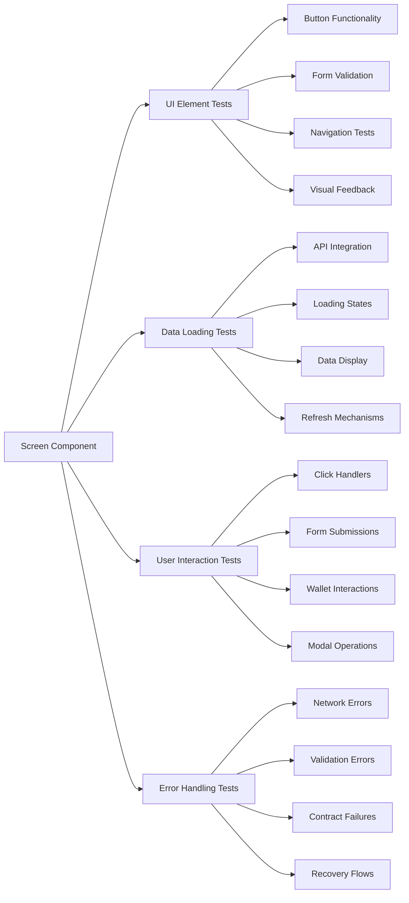

# Design Document

## Overview

This design document outlines a comprehensive testing and validation approach for the SeiMoney frontend application. The system will systematically test every screen, component, and user interaction to ensure proper integration with backend services, smart contracts, bots, and AI agents while validating that all features display real data and function correctly.

The testing approach follows a structured methodology that combines automated testing tools with manual validation procedures to ensure complete coverage of all user scenarios and edge cases.

## Architecture

### Testing Framework Architecture

```mermaid
graph TB
    A[Frontend Testing Suite] --> B[Screen Testing Module]
    A --> C[Integration Testing Module]
    A --> D[Data Validation Module]
    A --> E[User Workflow Module]
    
    B --> B1[Home Screen Tests]
    B --> B2[Dashboard Tests]
    B --> B3[Payments Tests]
    B --> B4[Vaults Tests]
    B --> B5[Groups Tests]
    B --> B6[AI Agent Tests]
    
    C --> C1[Backend API Tests]
    C --> C2[Smart Contract Tests]
    C --> C3[Wallet Integration Tests]
    C --> C4[Bot Communication Tests]
    
    D --> D1[Real Data Verification]
    D --> D2[Market Data Validation]
    D --> D3[Transaction Verification]
    D --> D4[Balance Accuracy Tests]
    
    E --> E1[Onboarding Flow Tests]
    E --> E2[Transaction Flow Tests]
    E --> E3[Investment Flow Tests]
    E --> E4[Error Recovery Tests]
```



### Component Testing Structure



## Components and Interfaces

### 1. Screen Testing Components

#### Home Screen Validator
- **Purpose**: Validate home screen functionality and data display
- **Key Features**:
  - Market statistics verification
  - Navigation button testing
  - Real-time data loading validation
  - Performance metrics collection

#### Dashboard Validator
- **Purpose**: Comprehensive dashboard testing including wallet integration
- **Key Features**:
  - Portfolio value calculation verification
  - Real-time balance updates
  - Chart data accuracy
  - Quick action functionality

#### Payments Screen Validator
- **Purpose**: Test payment creation and management functionality
- **Key Features**:
  - Form validation testing
  - Smart contract interaction verification
  - Transaction status tracking
  - Error handling validation

#### Vaults Screen Validator
- **Purpose**: Validate DeFi vault operations and data display
- **Key Features**:
  - Vault performance data verification
  - Deposit/withdrawal flow testing
  - APY calculation accuracy
  - Risk assessment display

#### Groups Screen Validator
- **Purpose**: Test group savings functionality
- **Key Features**:
  - Group creation workflow
  - Participation tracking
  - Contribution verification
  - Goal progress accuracy

#### AI Agent Screen Validator
- **Purpose**: Validate AI agent interactions and responses
- **Key Features**:
  - AI service connectivity
  - Response accuracy testing
  - Recommendation validation
  - Bot integration verification

### 2. Integration Testing Components

#### Backend API Tester
```typescript
interface BackendAPITester {
  testHealthEndpoint(): Promise<TestResult>;
  testMarketDataEndpoints(): Promise<TestResult>;
  testTransferEndpoints(): Promise<TestResult>;
  testVaultEndpoints(): Promise<TestResult>;
  testUserDataEndpoints(): Promise<TestResult>;
  validateResponseFormats(): Promise<TestResult>;
  testErrorHandling(): Promise<TestResult>;
}
```

#### Smart Contract Tester
```typescript
interface SmartContractTester {
  testPaymentsContract(): Promise<TestResult>;
  testVaultsContract(): Promise<TestResult>;
  testGroupsContract(): Promise<TestResult>;
  testEscrowContract(): Promise<TestResult>;
  validateContractStates(): Promise<TestResult>;
  testTransactionExecution(): Promise<TestResult>;
}
```

#### Wallet Integration Tester
```typescript
interface WalletIntegrationTester {
  testKeplrConnection(): Promise<TestResult>;
  testLeapConnection(): Promise<TestResult>;
  testMetaMaskConnection(): Promise<TestResult>;
  testWalletSwitching(): Promise<TestResult>;
  testTransactionSigning(): Promise<TestResult>;
  testBalanceUpdates(): Promise<TestResult>;
}
```

### 3. Data Validation Components

#### Real Data Validator
```typescript
interface RealDataValidator {
  validateMarketStatistics(): Promise<ValidationResult>;
  validatePortfolioValues(): Promise<ValidationResult>;
  validateTransactionHistory(): Promise<ValidationResult>;
  validateVaultPerformance(): Promise<ValidationResult>;
  validateBalanceAccuracy(): Promise<ValidationResult>;
  crossReferenceBlockchainData(): Promise<ValidationResult>;
}
```

#### Market Data Validator
```typescript
interface MarketDataValidator {
  validateTVLData(): Promise<ValidationResult>;
  validateAPYCalculations(): Promise<ValidationResult>;
  validatePriceFeeds(): Promise<ValidationResult>;
  validateHistoricalData(): Promise<ValidationResult>;
  testDataFreshness(): Promise<ValidationResult>;
}
```

### 4. User Workflow Components

#### Workflow Tester
```typescript
interface WorkflowTester {
  testCompleteOnboarding(): Promise<WorkflowResult>;
  testPaymentCreation(): Promise<WorkflowResult>;
  testVaultInvestment(): Promise<WorkflowResult>;
  testGroupParticipation(): Promise<WorkflowResult>;
  testEscrowTransaction(): Promise<WorkflowResult>;
  testErrorRecovery(): Promise<WorkflowResult>;
}
```

## Data Models

### Test Result Models

```typescript
interface TestResult {
  testName: string;
  status: 'passed' | 'failed' | 'warning';
  executionTime: number;
  details: string;
  errors?: string[];
  screenshots?: string[];
  timestamp: Date;
}

interface ValidationResult {
  component: string;
  dataSource: string;
  isValid: boolean;
  expectedValue: any;
  actualValue: any;
  tolerance?: number;
  message: string;
  timestamp: Date;
}

interface WorkflowResult {
  workflowName: string;
  steps: WorkflowStep[];
  overallStatus: 'completed' | 'failed' | 'partial';
  totalTime: number;
  failurePoint?: string;
  recoveryActions?: string[];
}

interface WorkflowStep {
  stepName: string;
  status: 'completed' | 'failed' | 'skipped';
  duration: number;
  details: string;
  screenshot?: string;
}
```

### Screen Testing Models

```typescript
interface ScreenTestConfig {
  screenName: string;
  testCases: TestCase[];
  dataValidations: DataValidation[];
  userInteractions: UserInteraction[];
  performanceThresholds: PerformanceThreshold[];
}

interface TestCase {
  name: string;
  description: string;
  preconditions: string[];
  steps: string[];
  expectedResults: string[];
  priority: 'high' | 'medium' | 'low';
}

interface DataValidation {
  elementSelector: string;
  dataSource: string;
  validationType: 'exact' | 'range' | 'format' | 'presence';
  expectedValue?: any;
  tolerance?: number;
}

interface UserInteraction {
  action: 'click' | 'input' | 'scroll' | 'hover' | 'drag';
  target: string;
  value?: string;
  expectedResponse: string;
  timeout: number;
}
```

## Error Handling

### Error Classification System

```typescript
enum ErrorSeverity {
  CRITICAL = 'critical',    // Blocks core functionality
  HIGH = 'high',           // Affects major features
  MEDIUM = 'medium',       // Minor functionality issues
  LOW = 'low'              // Cosmetic or edge case issues
}

interface ErrorReport {
  severity: ErrorSeverity;
  category: 'ui' | 'integration' | 'data' | 'performance' | 'security';
  description: string;
  reproduction: string[];
  expectedBehavior: string;
  actualBehavior: string;
  environment: EnvironmentInfo;
  screenshots: string[];
  logs: string[];
  suggestedFix?: string;
}
```

### Error Recovery Strategies

1. **Network Errors**
   - Automatic retry with exponential backoff
   - Fallback to cached data when available
   - Clear user notification with manual retry option

2. **Wallet Connection Errors**
   - Step-by-step troubleshooting guide
   - Alternative wallet suggestions
   - Connection status monitoring

3. **Smart Contract Errors**
   - Transaction failure analysis
   - Gas estimation improvements
   - Clear error message translation

4. **Data Validation Errors**
   - Input sanitization and validation
   - Real-time feedback during form completion
   - Graceful degradation for missing data

## Testing Strategy

### 1. Automated Testing Approach

#### Unit Testing
- Component-level testing for all React components
- API service testing for all backend integrations
- Utility function testing for calculations and validations

#### Integration Testing
- End-to-end user workflow testing
- Cross-component communication testing
- External service integration testing

#### Performance Testing
- Page load time measurement
- API response time monitoring
- Memory usage tracking
- Bundle size optimization validation

### 2. Manual Testing Procedures

#### Screen-by-Screen Validation
1. **Home Screen Testing**
   - Verify all statistics display real data
   - Test all navigation buttons
   - Validate responsive design
   - Check loading states and error handling

2. **Dashboard Testing**
   - Confirm wallet connection flow
   - Verify portfolio calculations
   - Test real-time data updates
   - Validate chart accuracy

3. **Feature Screen Testing**
   - Test all form validations
   - Verify smart contract interactions
   - Check transaction flows
   - Validate error scenarios

#### Cross-Browser Testing
- Chrome (latest and previous version)
- Safari (latest)
- Firefox (latest)
- Edge (latest)
- Mobile browsers (iOS Safari, Chrome Mobile)

#### Device Testing
- Desktop (1920x1080, 1366x768)
- Tablet (iPad, Android tablets)
- Mobile (iPhone, Android phones)
- Different screen densities

### 3. Real Data Validation Process

#### Data Source Verification
1. **Backend API Data**
   - Compare frontend display with API responses
   - Verify data transformation accuracy
   - Check for data staleness

2. **Blockchain Data**
   - Cross-reference with block explorers
   - Validate transaction details
   - Confirm balance accuracy

3. **Market Data**
   - Compare with external market sources
   - Verify calculation accuracy
   - Check update frequency

#### Data Consistency Checks
- Portfolio value calculations
- Transaction history completeness
- Balance reconciliation
- Performance metrics accuracy

### 4. User Experience Validation

#### Usability Testing
- New user onboarding flow
- Task completion rates
- Error recovery effectiveness
- Feature discoverability

#### Accessibility Testing
- Keyboard navigation
- Screen reader compatibility
- Color contrast validation
- Focus management

#### Performance Validation
- Page load times under various conditions
- Interaction responsiveness
- Memory usage patterns
- Network efficiency

## Implementation Guidelines

### Testing Environment Setup

1. **Test Data Preparation**
   - Create test wallets with known balances
   - Set up test smart contracts
   - Prepare mock market data
   - Configure test backend environment

2. **Monitoring and Logging**
   - Implement comprehensive error logging
   - Set up performance monitoring
   - Create test result dashboards
   - Configure alerting for critical failures

3. **Continuous Integration**
   - Automated test execution on code changes
   - Performance regression detection
   - Cross-browser testing automation
   - Test result reporting and analysis

### Quality Assurance Process

1. **Pre-Release Testing**
   - Complete test suite execution
   - Manual exploratory testing
   - Performance benchmark validation
   - Security vulnerability scanning

2. **Post-Release Monitoring**
   - Real user monitoring
   - Error rate tracking
   - Performance metrics collection
   - User feedback analysis

3. **Continuous Improvement**
   - Test coverage analysis
   - Test effectiveness evaluation
   - Process optimization
   - Tool and framework updates

This comprehensive testing design ensures that every aspect of the SeiMoney frontend application is thoroughly validated, from individual component functionality to complete user workflows, with special emphasis on real data accuracy and integration reliability.