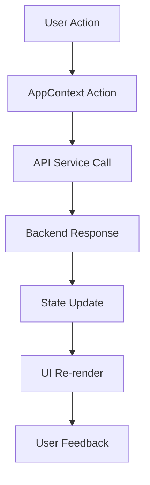

# Design Document

## Overview

This design document outlines the architecture and implementation approach for optimizing the Payments page in the SeiMoney frontend application. The design focuses on creating a robust, error-free payment interface that handles wallet connections, data loading, transfer creation, and real-time updates seamlessly.

## Architecture

### Component Architecture

```
Payments Page
├── Header Section
│   ├── Title & Description
│   └── Balance Display
├── Statistics Cards
│   ├── Total Sent
│   ├── Total Received
│   ├── Pending Transfers
│   └── Success Rate
├── Main Content Grid
│   ├── Transfer Creation Form (Left)
│   └── Transfers List (Right)
└── Real-time Updates System
```

### State Management Flow



## Components and Interfaces

### 1. Wallet Connection System

**Interface:**
```typescript
interface WalletConnection {
  provider: 'metamask' | 'keplr' | 'leap';
  address: string;
  balance: number;
  isConnected: boolean;
  evmAddress?: string;
  cosmosAddress?: string;
}
```

**Implementation Strategy:**
- Use existing wallet services (metamaskWallet, keplrWallet, leapWallet)
- Implement address validation (45+ characters for Sei addresses)
- Handle EVM to Cosmos address conversion for MetaMask
- Store connection state in localStorage for persistence
- Implement auto-reconnection on page load

### 2. Data Loading System

**Interface:**
```typescript
interface DataLoader {
  loadTransfers(address: string): Promise<Transfer[]>;
  loadMarketData(): Promise<MarketData>;
  loadUserBalance(address: string): Promise<number>;
  refreshData(): Promise<void>;
}
```

**Implementation Strategy:**
- Implement progressive data loading (essential data first)
- Use Promise.allSettled for parallel loading with error isolation
- Implement retry logic for failed requests
- Cache data in localStorage for offline access
- Show loading states and skeleton components

### 3. Transfer Creation Form

**Interface:**
```typescript
interface TransferForm {
  recipient: string;
  amount: string;
  expiry: string;
  remark?: string;
}

interface FormValidation {
  validateRecipient(address: string): ValidationResult;
  validateAmount(amount: string, balance: number): ValidationResult;
  validateExpiry(date: string): ValidationResult;
}
```

**Implementation Strategy:**
- Real-time form validation with immediate feedback
- Address format validation (Sei address format)
- Balance checking against available funds
- Date validation for expiry (must be future date)
- Form state management with error handling
- Auto-reset form after successful submission

### 4. Real-time Updates System

**Interface:**
```typescript
interface UpdateSystem {
  startPolling(): void;
  stopPolling(): void;
  refreshInterval: number;
  onDataUpdate(callback: (data: any) => void): void;
}
```

**Implementation Strategy:**
- Implement 30-second polling for market data and transfers
- Use React useEffect with cleanup for interval management
- Implement smart polling (only when page is visible)
- Handle network errors gracefully
- Show update indicators to users

## Data Models

### Transfer Model Enhancement
```typescript
interface Transfer {
  id: string;
  sender: string;
  recipient: string;
  amount: number | string;
  status: 'pending' | 'completed' | 'expired' | 'refunded';
  expiry: string;
  remark?: string;
  createdAt: string;
  updatedAt: string;
}
```

### Market Data Model
```typescript
interface MarketData {
  price: number;
  change24h: number;
  volume24h: number;
  marketCap: number;
  tvl: number;
  activeUsers: number;
}
```

### Statistics Model
```typescript
interface TransferStats {
  totalSent: number;
  totalReceived: number;
  pending: number;
  successRate: number;
}
```

## Error Handling

### Error Classification System

1. **Network Errors**
   - Connection timeouts
   - Server unavailable
   - API endpoint errors

2. **Validation Errors**
   - Invalid address format
   - Insufficient balance
   - Invalid form data

3. **Wallet Errors**
   - Wallet not installed
   - Connection rejected
   - Transaction failures

### Error Handling Strategy

```typescript
interface ErrorHandler {
  handleNetworkError(error: NetworkError): void;
  handleValidationError(error: ValidationError): void;
  handleWalletError(error: WalletError): void;
  showUserFriendlyMessage(error: Error): void;
}
```

**Implementation:**
- Categorize errors by type and severity
- Provide specific error messages for each scenario
- Implement retry mechanisms for transient errors
- Show fallback content when data loading fails
- Log errors for debugging while showing user-friendly messages

## Testing Strategy

### Unit Testing
- Test individual components in isolation
- Mock API calls and wallet connections
- Test form validation logic
- Test error handling scenarios

### Integration Testing
- Test wallet connection flow end-to-end
- Test data loading and state management
- Test transfer creation process
- Test real-time updates

### User Acceptance Testing
- Test with real wallet connections
- Test with actual backend API
- Test error scenarios (network failures, invalid data)
- Test performance under load

### Testing Tools
- Jest for unit testing
- React Testing Library for component testing
- Cypress for end-to-end testing
- Manual testing with real wallets

## Performance Optimization

### Loading Optimization
- Implement lazy loading for non-critical components
- Use React.memo for expensive components
- Optimize re-renders with proper dependency arrays
- Implement virtual scrolling for large transfer lists

### Data Optimization
- Cache API responses in localStorage
- Implement smart polling (only when needed)
- Use debouncing for form validation
- Optimize bundle size with code splitting

### User Experience Optimization
- Show loading states immediately
- Implement optimistic updates for transfers
- Provide immediate feedback for user actions
- Use skeleton components for better perceived performance

## Security Considerations

### Data Validation
- Validate all user inputs on both client and server
- Sanitize data before displaying
- Implement proper address format validation
- Validate transaction amounts and limits

### Wallet Security
- Never store private keys or sensitive data
- Use secure communication with wallet extensions
- Implement proper session management
- Handle wallet disconnection gracefully

### API Security
- Implement proper authentication
- Use HTTPS for all API calls
- Validate API responses before processing
- Handle sensitive data appropriately

## Monitoring and Analytics

### Performance Monitoring
- Track page load times
- Monitor API response times
- Track error rates and types
- Monitor wallet connection success rates

### User Analytics
- Track user interactions with the payment form
- Monitor transfer creation success rates
- Track wallet provider usage
- Monitor feature adoption rates

### Error Tracking
- Log all errors with context
- Track error patterns and frequencies
- Monitor API failure rates
- Track wallet connection issues

## Deployment Strategy

### Development Environment
- Local development with mock data
- Integration with local backend
- Wallet testing with testnet

### Staging Environment
- Full integration testing
- Performance testing
- Security testing
- User acceptance testing

### Production Environment
- Gradual rollout with feature flags
- Real-time monitoring
- Error tracking and alerting
- Performance monitoring