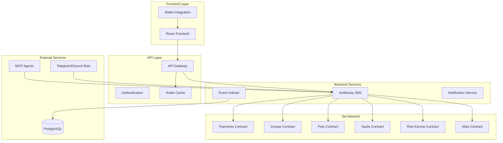
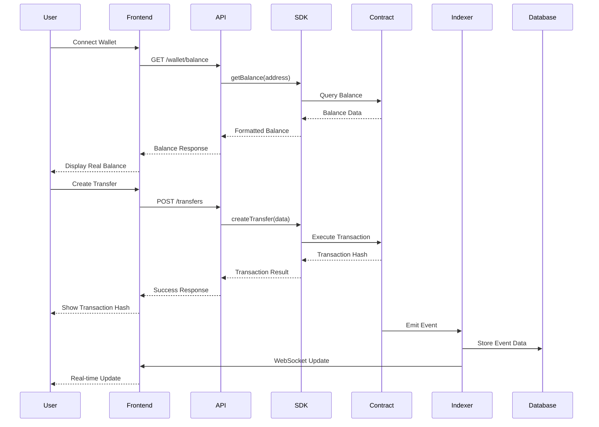

# Design Document - Real Data Integration for SeiMoney

## Overview

This design document outlines the technical approach for implementing comprehensive real data integration across the SeiMoney DeFi platform. The goal is to replace all mock data with real blockchain data and create seamless user experiences with actual transaction flows.

The integration will connect:
- **Smart Contracts**: 6 deployed contracts on Sei testnet (atlantic-2)
- **Backend API**: Node.js/Fastify services with real SDK integration
- **Frontend**: React application with real-time data display
- **MCP Agents**: AI agents processing real blockchain data
- **Bots**: Telegram/Discord bots with real wallet integration

## Architecture

### High-Level Architecture



### Data Flow Architecture



## Components and Interfaces

### 1. Smart Contract Integration Layer

#### Contract Addresses (Sei Testnet - atlantic-2)
```typescript
export const CONTRACTS = {
  PAYMENTS: "sei1kfpm92hs5gsmp84098wc3jpy2a440l50cq2ycsxlkpnlaygl9azqdhsygg",
  GROUPS: "sei1vq3ncyvf4k22lc0xhm7x6dtkn6jyxkexa2xy6uk2sj33dysnyy2syn73qt",
  POTS: "sei1c5d4flfqv3zjms0g894z82hnhv62h2vjr9hgd05c6xh456q8xjfq8f3qmj",
  ALIAS: "sei1thjuavd70uq7txe79uj8pfy2vfyl3zvmenkyxh6ew4vag9mckq4qrtjav4",
  RISK_ESCROW: "sei1q3gqr9ywvma6j6kja67n4h7fxz790x5lhj4v5phv2za0v7wsp5qqkrz0pj",
  VAULTS: "sei12k2yxf3cyec8p89qtgm5w30m4g2775tn7j8wx4jpuallygu45r9qs68u2h",
} as const;

export const NETWORK_CONFIG = {
  CHAIN_ID: "atlantic-2",
  RPC_URL: "https://rpc.atlantic-2.seinetwork.io:443",
  EVM_RPC: "https://evm-rpc-testnet.sei-apis.com",
  EXPLORER: "https://seitrace.com",
  DENOM: "usei",
} as const;
```

#### Enhanced SDK Integration
```typescript
// Enhanced SDK with write operations
export class SeiMoneySDKEnhanced extends SeiMoneySDK {
  private signingClient: SigningCosmWasmClient;
  
  constructor(client: CosmWasmClient, signingClient?: SigningCosmWasmClient) {
    super(client);
    this.signingClient = signingClient;
  }
  
  // Write operations for real transactions
  async createTransfer(sender: string, data: CreateTransferMsg): Promise<ExecuteResult> {
    return this.signingClient.execute(
      sender,
      CONTRACTS.PAYMENTS,
      { create_transfer: data },
      "auto"
    );
  }
  
  async claimTransfer(recipient: string, transferId: number): Promise<ExecuteResult> {
    return this.signingClient.execute(
      recipient,
      CONTRACTS.PAYMENTS,
      { claim_transfer: { id: transferId } },
      "auto"
    );
  }
  
  // Real balance queries
  async getWalletBalance(address: string): Promise<Coin[]> {
    return this.client.getAllBalances(address);
  }
  
  // Real contract state queries
  async getTransfersByUser(address: string): Promise<Transfer[]> {
    const [sent, received] = await Promise.all([
      this.listTransfersBySender(address),
      this.listTransfersByRecipient(address)
    ]);
    
    return [...sent, ...received].sort((a, b) => 
      new Date(b.created_at).getTime() - new Date(a.created_at).getTime()
    );
  }
}
```

### 2. Backend API Enhancement

#### Real Data Service Layer
```typescript
// services/realDataService.ts
export class RealDataService {
  private sdk: SeiMoneySDKEnhanced;
  private cache: Redis;
  
  constructor(sdk: SeiMoneySDKEnhanced, cache: Redis) {
    this.sdk = sdk;
    this.cache = cache;
  }
  
  async getUserPortfolio(address: string): Promise<UserPortfolio> {
    const cacheKey = `portfolio:${address}`;
    const cached = await this.cache.get(cacheKey);
    
    if (cached) {
      return JSON.parse(cached);
    }
    
    const [balance, transfers, vaultPositions, groupContributions, pots] = await Promise.all([
      this.sdk.getWalletBalance(address),
      this.sdk.getTransfersByUser(address),
      this.sdk.getUserVaultPositions(address),
      this.sdk.getUserGroupContributions(address),
      this.sdk.getUserPots(address)
    ]);
    
    const portfolio: UserPortfolio = {
      totalBalance: this.calculateTotalValue(balance, vaultPositions),
      transfers,
      vaultPositions,
      groupContributions,
      pots,
      lastUpdated: new Date().toISOString()
    };
    
    // Cache for 30 seconds
    await this.cache.setex(cacheKey, 30, JSON.stringify(portfolio));
    
    return portfolio;
  }
  
  async getMarketStats(): Promise<MarketStats> {
    const [totalTvl, activeUsers, totalTransactions] = await Promise.all([
      this.calculateTotalTVL(),
      this.getActiveUsersCount(),
      this.getTotalTransactionsCount()
    ]);
    
    return {
      totalTvl,
      activeUsers,
      totalTransactions,
      successRate: await this.calculateSuccessRate(),
      avgApy: await this.calculateAverageAPY(),
      timestamp: new Date().toISOString()
    };
  }
  
  private async calculateTotalTVL(): Promise<number> {
    const vaults = await this.sdk.listVaults();
    return vaults.reduce((total, vault) => total + parseFloat(vault.tvl || '0'), 0);
  }
}
```

#### Enhanced API Routes
```typescript
// routes/transfers.ts - Real Implementation
export async function transfersRoutes(fastify: FastifyInstance): Promise<void> {
  const realDataService = new RealDataService(await getSdk(), fastify.redis);
  
  // Get user transfers with real data
  fastify.get('/', async (request: AuthenticatedRequest, reply) => {
    try {
      const userAddress = request.user.address;
      const transfers = await realDataService.getUserTransfers(userAddress);
      
      reply.send({
        ok: true,
        data: {
          transfers,
          total: transfers.length
        }
      });
    } catch (error) {
      logger.error('Error fetching real transfers:', error);
      reply.status(500).send({
        ok: false,
        error: 'Failed to fetch transfers',
        details: error.message
      });
    }
  });
  
  // Create real transfer
  fastify.post('/', async (request: AuthenticatedRequest, reply) => {
    try {
      const { recipient, amount, expiry, remark } = request.body;
      const sender = request.user.address;
      
      // Execute real transaction
      const result = await realDataService.createTransfer(sender, {
        recipient,
        amount: { amount: amount.toString(), denom: 'usei' },
        expiry_ts: expiry ? Math.floor(new Date(expiry).getTime() / 1000) : null,
        remark
      });
      
      reply.send({
        ok: true,
        data: {
          transferId: result.events.find(e => e.type === 'wasm')?.attributes
            .find(a => a.key === 'transfer_id')?.value,
          txHash: result.transactionHash,
          height: result.height
        }
      });
    } catch (error) {
      logger.error('Error creating real transfer:', error);
      reply.status(500).send({
        ok: false,
        error: 'Failed to create transfer',
        details: error.message
      });
    }
  });
}
```

### 3. Frontend Real Data Integration

#### Enhanced App Context
```typescript
// contexts/AppContext.tsx - Real Data Integration
interface AppState {
  // Real wallet connection
  wallet: {
    address: string;
    balance: number;
    isConnected: boolean;
    provider: 'keplr' | 'leap' | null;
  } | null;
  
  // Real data from contracts
  transfers: Transfer[];
  vaults: Vault[];
  groups: Group[];
  pots: SavingsPot[];
  
  // Real-time updates
  isLoading: boolean;
  lastUpdated: string | null;
  
  // Real market data
  marketStats: MarketStats | null;
}

interface AppActions {
  // Real wallet operations
  connectWallet: (provider: 'keplr' | 'leap') => Promise<void>;
  disconnectWallet: () => void;
  
  // Real contract interactions
  createTransfer: (data: CreateTransferData) => Promise<void>;
  claimTransfer: (transferId: string) => Promise<void>;
  
  // Real data fetching
  refreshUserData: () => Promise<void>;
  refreshMarketData: () => Promise<void>;
}

export const AppProvider: React.FC<{ children: React.ReactNode }> = ({ children }) => {
  const [state, setState] = useState<AppState>(initialState);
  
  // Real wallet connection
  const connectWallet = async (provider: 'keplr' | 'leap') => {
    try {
      setState(prev => ({ ...prev, isLoading: true }));
      
      const wallet = await connectToWallet(provider);
      const balance = await apiService.getWalletBalance(wallet.address);
      
      setState(prev => ({
        ...prev,
        wallet: {
          address: wallet.address,
          balance: parseFloat(balance.amount),
          isConnected: true,
          provider
        },
        isLoading: false
      }));
      
      // Fetch user data after connection
      await refreshUserData();
    } catch (error) {
      console.error('Wallet connection failed:', error);
      setState(prev => ({ ...prev, isLoading: false }));
      throw error;
    }
  };
  
  // Real data fetching
  const refreshUserData = async () => {
    if (!state.wallet?.address) return;
    
    try {
      setState(prev => ({ ...prev, isLoading: true }));
      
      const [transfers, vaults, groups, pots] = await Promise.all([
        apiService.getTransfers(),
        apiService.getVaults(),
        apiService.getGroups(),
        apiService.getPots()
      ]);
      
      setState(prev => ({
        ...prev,
        transfers,
        vaults,
        groups,
        pots,
        isLoading: false,
        lastUpdated: new Date().toISOString()
      }));
    } catch (error) {
      console.error('Failed to refresh user data:', error);
      setState(prev => ({ ...prev, isLoading: false }));
    }
  };
  
  // Real transaction execution
  const createTransfer = async (data: CreateTransferData) => {
    if (!state.wallet?.isConnected) {
      throw new Error('Wallet not connected');
    }
    
    try {
      setState(prev => ({ ...prev, isLoading: true }));
      
      const result = await apiService.createTransfer(data);
      
      // Refresh data after successful transaction
      await refreshUserData();
      
      // Show success notification with real tx hash
      addNotification(`Transfer created! Tx: ${result.txHash}`, 'success');
    } catch (error) {
      console.error('Transfer creation failed:', error);
      addNotification(`Transfer failed: ${error.message}`, 'error');
      throw error;
    } finally {
      setState(prev => ({ ...prev, isLoading: false }));
    }
  };
  
  return (
    <AppContext.Provider value={{ state, actions: { connectWallet, refreshUserData, createTransfer } }}>
      {children}
    </AppContext.Provider>
  );
};
```

#### Real-Time Dashboard Component
```typescript
// components/pages/Dashboard.tsx - Real Data Display
export const Dashboard: React.FC<DashboardProps> = ({ onNavigate }) => {
  const { state, actions } = useApp();
  const [realTimeStats, setRealTimeStats] = useState<MarketStats | null>(null);
  
  // Real-time data updates
  useEffect(() => {
    if (state.wallet?.isConnected) {
      // Initial data load
      actions.refreshUserData();
      actions.refreshMarketData();
      
      // Set up real-time updates every 30 seconds
      const interval = setInterval(() => {
        actions.refreshUserData();
        actions.refreshMarketData();
      }, 30000);
      
      return () => clearInterval(interval);
    }
  }, [state.wallet?.isConnected]);
  
  // Calculate real portfolio value
  const portfolioValue = useMemo(() => {
    if (!state.wallet) return 0;
    
    const walletBalance = state.wallet.balance;
    const vaultValue = state.vaults.reduce((total, vault) => 
      total + (vault.userPosition?.value || 0), 0);
    const groupContributions = state.groups.reduce((total, group) => 
      total + (group.userContribution || 0), 0);
    
    return walletBalance + vaultValue + groupContributions;
  }, [state.wallet, state.vaults, state.groups]);
  
  // Real transaction history
  const recentTransactions = useMemo(() => {
    return state.transfers
      .sort((a, b) => new Date(b.createdAt).getTime() - new Date(a.createdAt).getTime())
      .slice(0, 5);
  }, [state.transfers]);
  
  return (
    <div className="min-h-screen p-6 space-y-6">
      {/* Real Portfolio Overview */}
      <motion.div className="grid grid-cols-1 md:grid-cols-2 lg:grid-cols-4 gap-6">
        <GlassCard glow="green" className="p-6">
          <div className="flex items-center justify-between mb-4">
            <div>
              <p className="text-sm text-gray-400">Total Balance</p>
              <p className="text-2xl font-bold text-white">
                {state.wallet?.isConnected ? 
                  `${portfolioValue.toFixed(2)} SEI` : 
                  'Connect Wallet'
                }
              </p>
            </div>
            {state.isLoading && (
              <Loader2 className="w-5 h-5 animate-spin text-green-400" />
            )}
          </div>
          {state.lastUpdated && (
            <div className="text-xs text-gray-500">
              Last updated: {new Date(state.lastUpdated).toLocaleTimeString()}
            </div>
          )}
        </GlassCard>
        
        {/* Real Vault Positions */}
        <GlassCard glow="purple" className="p-6">
          <div className="flex items-center space-x-3">
            <div className="w-12 h-12 rounded-lg bg-purple-500/20 flex items-center justify-center">
              <TrendingUp size={24} className="text-purple-400" />
            </div>
            <div>
              <p className="text-sm text-gray-400">Active Vaults</p>
              <p className="text-2xl font-bold text-white">
                {state.vaults.filter(v => v.userPosition?.shares > 0).length}
              </p>
            </div>
          </div>
        </GlassCard>
        
        {/* Real Group Contributions */}
        <GlassCard className="p-6">
          <div className="flex items-center space-x-3">
            <div className="w-12 h-12 rounded-lg bg-blue-500/20 flex items-center justify-center">
              <Users size={24} className="text-blue-400" />
            </div>
            <div>
              <p className="text-sm text-gray-400">Group Pools</p>
              <p className="text-2xl font-bold text-white">
                {state.groups.filter(g => g.userContribution > 0).length}
              </p>
            </div>
          </div>
        </GlassCard>
        
        {/* Real Savings Progress */}
        <GlassCard className="p-6">
          <div className="flex items-center space-x-3">
            <div className="w-12 h-12 rounded-lg bg-orange-500/20 flex items-center justify-center">
              <PieChart size={24} className="text-orange-400" />
            </div>
            <div>
              <p className="text-sm text-gray-400">Savings Pots</p>
              <p className="text-2xl font-bold text-white">
                {state.pots.length}
              </p>
            </div>
          </div>
        </GlassCard>
      </motion.div>
      
      {/* Real Transaction History */}
      <GlassCard className="p-6">
        <div className="flex items-center justify-between mb-6">
          <h3 className="text-xl font-semibold text-white">Recent Transactions</h3>
          <NeonButton variant="outline" size="sm" onClick={() => onNavigate('payments')}>
            View All
          </NeonButton>
        </div>
        
        {state.isLoading ? (
          <div className="flex items-center justify-center py-8">
            <Loader2 className="w-8 h-8 animate-spin text-green-400" />
            <span className="ml-2 text-white">Loading real transactions...</span>
          </div>
        ) : recentTransactions.length === 0 ? (
          <div className="text-center py-8">
            <p className="text-gray-400">No transactions found</p>
            {state.wallet?.isConnected ? (
              <p className="text-sm mt-2 text-gray-500">
                Create your first transfer to see activity here
              </p>
            ) : (
              <p className="text-sm mt-2 text-gray-500">
                Connect your wallet to view transactions
              </p>
            )}
          </div>
        ) : (
          <div className="space-y-4">
            {recentTransactions.map((tx, index) => (
              <motion.div
                key={tx.id}
                className="flex items-center justify-between p-4 rounded-lg bg-white/5"
                initial={{ opacity: 0, y: 20 }}
                animate={{ opacity: 1, y: 0 }}
                transition={{ delay: index * 0.1 }}
              >
                <div className="flex items-center space-x-4">
                  <div className="w-10 h-10 rounded-full bg-green-500/20 flex items-center justify-center">
                    <ArrowUpRight size={20} className="text-green-400" />
                  </div>
                  <div>
                    <p className="text-white font-medium">
                      {tx.type === 'sent' ? 'Sent to' : 'Received from'} {tx.recipient}
                    </p>
                    <p className="text-sm text-gray-400">
                      {tx.remark || 'No description'}
                    </p>
                  </div>
                </div>
                <div className="text-right">
                  <p className="text-white font-bold">
                    {tx.type === 'sent' ? '-' : '+'}{tx.amount} SEI
                  </p>
                  <p className="text-sm text-gray-400">
                    {new Date(tx.createdAt).toLocaleString()}
                  </p>
                </div>
              </motion.div>
            ))}
          </div>
        )}
      </GlassCard>
    </div>
  );
};
```

## Data Models

### Real Data Types
```typescript
// types/realData.ts
export interface RealTransfer {
  id: string;
  sender: string;
  recipient: string;
  amount: string;
  denom: string;
  status: 'pending' | 'claimed' | 'refunded' | 'expired';
  createdAt: string;
  expiryTs: number | null;
  remark: string | null;
  txHash: string;
  blockHeight: number;
}

export interface RealVault {
  id: string;
  label: string;
  strategy: string;
  tvl: string;
  apy: number;
  feesBps: number;
  userPosition?: {
    shares: string;
    value: number;
    percentage: number;
  };
}

export interface RealGroup {
  id: string;
  name: string;
  target: {
    amount: string;
    denom: string;
  };
  currentAmount: string;
  participants: number;
  maxParticipants: number | null;
  status: 'active' | 'completed' | 'expired';
  expiryTs: number | null;
  userContribution: number;
}

export interface UserPortfolio {
  totalBalance: number;
  transfers: RealTransfer[];
  vaultPositions: RealVault[];
  groupContributions: RealGroup[];
  pots: RealSavingsPot[];
  lastUpdated: string;
}

export interface MarketStats {
  totalTvl: number;
  activeUsers: number;
  totalTransactions: number;
  successRate: number;
  avgApy: number;
  timestamp: string;
}
```

## Error Handling

### Blockchain Error Handling
```typescript
export class BlockchainErrorHandler {
  static handleContractError(error: any): UserFriendlyError {
    if (error.message.includes('insufficient funds')) {
      return {
        type: 'INSUFFICIENT_FUNDS',
        message: 'Insufficient balance to complete transaction',
        suggestion: 'Please add more SEI to your wallet'
      };
    }
    
    if (error.message.includes('transfer not found')) {
      return {
        type: 'TRANSFER_NOT_FOUND',
        message: 'Transfer not found',
        suggestion: 'Please check the transfer ID and try again'
      };
    }
    
    if (error.message.includes('expired')) {
      return {
        type: 'TRANSFER_EXPIRED',
        message: 'Transfer has expired',
        suggestion: 'This transfer can no longer be claimed'
      };
    }
    
    return {
      type: 'UNKNOWN_ERROR',
      message: 'An unexpected error occurred',
      suggestion: 'Please try again or contact support'
    };
  }
  
  static handleNetworkError(error: any): UserFriendlyError {
    if (error.code === 'NETWORK_ERROR') {
      return {
        type: 'NETWORK_ERROR',
        message: 'Network connection failed',
        suggestion: 'Please check your internet connection and try again'
      };
    }
    
    if (error.code === 'TIMEOUT') {
      return {
        type: 'TIMEOUT',
        message: 'Request timed out',
        suggestion: 'The network is busy. Please try again in a moment'
      };
    }
    
    return {
      type: 'NETWORK_ERROR',
      message: 'Network error occurred',
      suggestion: 'Please try again later'
    };
  }
}
```

## Testing Strategy

### Integration Testing with Real Contracts
```typescript
// tests/integration/realData.test.ts
describe('Real Data Integration', () => {
  let sdk: SeiMoneySDKEnhanced;
  let testWallet: DirectSecp256k1HdWallet;
  
  beforeAll(async () => {
    // Connect to testnet
    const client = await CosmWasmClient.connect(NETWORK_CONFIG.RPC_URL);
    const signingClient = await SigningCosmWasmClient.connectWithSigner(
      NETWORK_CONFIG.RPC_URL,
      testWallet
    );
    
    sdk = new SeiMoneySDKEnhanced(client, signingClient);
  });
  
  test('should create and claim real transfer', async () => {
    const sender = await testWallet.getAccounts()[0].address;
    const recipient = 'sei1test...';
    
    // Create real transfer
    const createResult = await sdk.createTransfer(sender, {
      recipient,
      amount: { amount: '1000000', denom: 'usei' },
      expiry_ts: Math.floor(Date.now() / 1000) + 3600,
      remark: 'Test transfer'
    });
    
    expect(createResult.transactionHash).toBeDefined();
    
    // Verify transfer exists on-chain
    const transfers = await sdk.listTransfersBySender(sender);
    const newTransfer = transfers.find(t => t.recipient === recipient);
    
    expect(newTransfer).toBeDefined();
    expect(newTransfer.status).toBe('pending');
  });
  
  test('should fetch real vault data', async () => {
    const vaults = await sdk.listVaults();
    
    expect(Array.isArray(vaults)).toBe(true);
    
    if (vaults.length > 0) {
      const vault = vaults[0];
      expect(vault.id).toBeDefined();
      expect(vault.tvl).toBeDefined();
      expect(typeof vault.apy).toBe('number');
    }
  });
  
  test('should handle real wallet balance queries', async () => {
    const address = await testWallet.getAccounts()[0].address;
    const balance = await sdk.getWalletBalance(address);
    
    expect(Array.isArray(balance)).toBe(true);
    expect(balance.some(coin => coin.denom === 'usei')).toBe(true);
  });
});
```

### End-to-End User Scenarios
```typescript
// tests/e2e/userScenarios.test.ts
describe('Complete User Scenarios', () => {
  test('User creates transfer, recipient claims it', async () => {
    // 1. Connect sender wallet
    await page.click('[data-testid="connect-wallet"]');
    await page.click('[data-testid="keplr-option"]');
    
    // 2. Create transfer with real data
    await page.fill('[data-testid="recipient-input"]', RECIPIENT_ADDRESS);
    await page.fill('[data-testid="amount-input"]', '1');
    await page.click('[data-testid="create-transfer"]');
    
    // 3. Verify transaction hash appears
    await expect(page.locator('[data-testid="tx-hash"]')).toBeVisible();
    
    // 4. Switch to recipient wallet
    await switchWallet(RECIPIENT_ADDRESS);
    
    // 5. Claim the transfer
    await page.click('[data-testid="claim-transfer"]');
    
    // 6. Verify balance update
    const balanceAfter = await page.textContent('[data-testid="wallet-balance"]');
    expect(parseFloat(balanceAfter)).toBeGreaterThan(0);
  });
  
  test('User deposits to vault and sees real returns', async () => {
    // 1. Navigate to vaults
    await page.click('[data-testid="vaults-tab"]');
    
    // 2. Select a vault
    await page.click('[data-testid="vault-0"]');
    
    // 3. Deposit real amount
    await page.fill('[data-testid="deposit-amount"]', '10');
    await page.click('[data-testid="deposit-button"]');
    
    // 4. Verify shares received
    await expect(page.locator('[data-testid="user-shares"]')).toContainText('shares');
    
    // 5. Check vault position
    const position = await page.textContent('[data-testid="vault-position"]');
    expect(parseFloat(position)).toBeGreaterThan(0);
  });
});
```

This design provides a comprehensive approach to integrating real blockchain data throughout the SeiMoney platform, ensuring users experience actual DeFi functionality with real transactions, balances, and contract interactions.