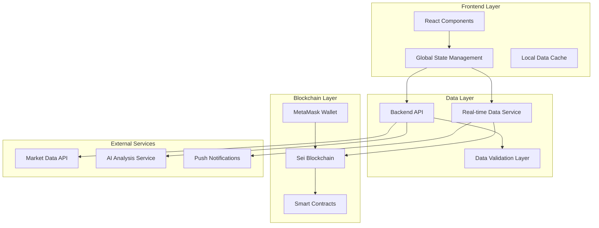
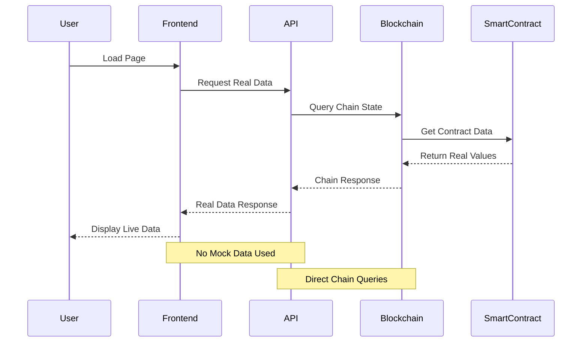

# Design Document

## Overview

تصميم نظام شامل لتحسين تجربة المستخدم مع التركيز على استخدام البيانات الحقيقية من المصادر الأصلية (API, Blockchain, Smart Contracts) بدلاً من البيانات الوهمية. النظام يوفر فلو ورك كامل لجميع الصفحات مع مزامنة البيانات الحية وإدارة الأخطاء المتقدمة.

## Architecture

### High-Level Architecture



### Real Data Flow Architecture



## Components and Interfaces

### 1. Real Data Service Layer

```typescript
// Real Data Service - يحل محل Mock Data تماماً
interface RealDataService {
  // Wallet Data - من MetaMask والـ blockchain مباشرة
  getWalletBalance(address: string): Promise<WalletBalance>;
  getWalletTransactions(address: string): Promise<Transaction[]>;
  
  // Savings Pots - من Smart Contracts
  getUserPots(address: string): Promise<SavingsPot[]>;
  getPotBalance(potId: string): Promise<number>;
  getAutoSaveStatus(potId: string): Promise<AutoSaveConfig>;
  
  // Escrow Service - من Escrow Contracts
  getUserEscrows(address: string): Promise<EscrowCase[]>;
  getEscrowStatus(escrowId: string): Promise<EscrowStatus>;
  getDisputeDetails(disputeId: string): Promise<DisputeInfo>;
  
  // Groups - من Group Contracts
  getUserGroups(address: string): Promise<Group[]>;
  getGroupContributions(groupId: string): Promise<Contribution[]>;
  getGroupProgress(groupId: string): Promise<GroupProgress>;
  
  // Vaults - من Vault Contracts
  getActiveVaults(): Promise<Vault[]>;
  getUserVaultPositions(address: string): Promise<VaultPosition[]>;
  getVaultPerformance(vaultId: string): Promise<PerformanceData>;
  
  // Market Data - من External APIs
  getLiveMarketData(): Promise<MarketData>;
  getPriceHistory(token: string): Promise<PricePoint[]>;
  getMarketMetrics(): Promise<MarketMetrics>;
}
```

### 2. Enhanced State Management

```typescript
// AppContext مع Real Data Integration
interface EnhancedAppState {
  // Real Wallet State
  wallet: {
    address: string;
    balance: number; // من blockchain مباشرة
    provider: WalletProvider;
    isConnected: boolean;
    lastUpdated: timestamp;
  };
  
  // Real Data Collections
  realData: {
    transfers: Transaction[]; // من chain history
    pots: SavingsPot[]; // من smart contracts
    escrows: EscrowCase[]; // من escrow contracts
    groups: Group[]; // من group contracts
    vaults: Vault[]; // من vault contracts
    marketData: MarketData; // من market APIs
  };
  
  // Data Sync Status
  syncStatus: {
    isLoading: boolean;
    lastSync: timestamp;
    errors: DataError[];
    retryCount: number;
  };
  
  // Real-time Updates
  realTimeUpdates: {
    enabled: boolean;
    interval: number;
    subscriptions: string[];
  };
}
```

### 3. Blockchain Integration Layer

```typescript
// Blockchain Service - للتفاعل المباشر مع الـ chain
class BlockchainService {
  private seiClient: SeiClient;
  private contractAddresses: ContractAddresses;
  
  // Real Balance Queries
  async getRealBalance(address: string): Promise<string> {
    const balance = await this.seiClient.getBalance(address, 'usei');
    return (parseInt(balance.amount) / 1000000).toString(); // Convert to SEI
  }
  
  // Real Transaction History
  async getRealTransactions(address: string): Promise<Transaction[]> {
    const txHistory = await this.seiClient.searchTx({
      sentFromOrTo: address
    });
    
    return txHistory.map(tx => ({
      id: tx.hash,
      sender: this.extractSender(tx),
      recipient: this.extractRecipient(tx),
      amount: this.extractAmount(tx),
      timestamp: new Date(tx.timestamp),
      status: tx.code === 0 ? 'completed' : 'failed',
      blockHeight: tx.height
    }));
  }
  
  // Real Smart Contract Queries
  async queryContract<T>(contractAddress: string, query: any): Promise<T> {
    return await this.seiClient.queryContractSmart(contractAddress, query);
  }
  
  // Real Contract Execution
  async executeContract(
    contractAddress: string, 
    msg: any, 
    funds?: Coin[]
  ): Promise<ExecuteResult> {
    return await this.seiClient.execute(
      this.walletAddress,
      contractAddress,
      msg,
      'auto',
      undefined,
      funds
    );
  }
}
```

### 4. Real-Time Data Synchronization

```typescript
// Real-Time Sync Service
class RealTimeSyncService {
  private syncInterval: NodeJS.Timeout | null = null;
  private websocketConnection: WebSocket | null = null;
  
  // Start Real-Time Sync
  startSync(address: string, updateCallback: (data: any) => void) {
    // WebSocket للتحديثات الفورية
    this.websocketConnection = new WebSocket(`wss://api.sei.io/ws/${address}`);
    
    this.websocketConnection.onmessage = (event) => {
      const realTimeData = JSON.parse(event.data);
      updateCallback(realTimeData);
    };
    
    // Polling للبيانات التي لا تدعم WebSocket
    this.syncInterval = setInterval(async () => {
      const freshData = await this.fetchFreshData(address);
      updateCallback(freshData);
    }, 30000); // كل 30 ثانية
  }
  
  // Fetch Fresh Data من المصادر الحقيقية
  private async fetchFreshData(address: string) {
    const [balance, transactions, pots, escrows, groups, vaults, marketData] = 
      await Promise.all([
        this.blockchainService.getRealBalance(address),
        this.blockchainService.getRealTransactions(address),
        this.contractService.getUserPots(address),
        this.contractService.getUserEscrows(address),
        this.contractService.getUserGroups(address),
        this.contractService.getUserVaults(address),
        this.marketService.getLiveMarketData()
      ]);
    
    return {
      wallet: { address, balance: parseFloat(balance) },
      transfers: transactions,
      pots,
      escrows,
      groups,
      vaults,
      marketData
    };
  }
}
```

## Data Models

### Real Data Models (No Mock Data)

```typescript
// Real Wallet Model
interface RealWallet {
  address: string; // من MetaMask
  balance: number; // من blockchain query
  provider: 'metamask' | 'keplr' | 'leap';
  chainId: string; // من network
  isConnected: boolean;
  lastBalanceUpdate: Date;
  transactionHistory: Transaction[]; // من chain history
}

// Real Savings Pot Model
interface RealSavingsPot {
  id: string; // من smart contract
  contractAddress: string;
  owner: string;
  name: string;
  targetAmount: number;
  currentAmount: number; // من contract state
  category: string;
  createdAt: Date;
  targetDate: Date;
  autoSaveEnabled: boolean;
  autoSaveAmount: number;
  autoSaveFrequency: 'daily' | 'weekly' | 'monthly';
  lastAutoSave: Date | null;
  status: 'active' | 'completed' | 'paused';
  transactions: PotTransaction[]; // من contract events
}

// Real Escrow Model
interface RealEscrowCase {
  id: string; // من smart contract
  contractAddress: string;
  title: string;
  description: string;
  amount: number; // من contract state
  buyer: string;
  seller: string;
  arbiter: string;
  status: 'created' | 'funded' | 'released' | 'disputed' | 'resolved';
  createdAt: Date;
  expiryDate: Date;
  terms: string[];
  milestones: EscrowMilestone[];
  disputeInfo?: DisputeInfo;
  contractEvents: EscrowEvent[]; // من blockchain events
}

// Real Group Model
interface RealGroup {
  id: string; // من smart contract
  contractAddress: string;
  name: string;
  description: string;
  creator: string;
  targetAmount: number;
  currentAmount: number; // من contract state
  maxParticipants: number;
  currentParticipants: number;
  participants: GroupParticipant[]; // من contract state
  status: 'active' | 'completed' | 'expired';
  createdAt: Date;
  expiryDate: Date;
  contributions: Contribution[]; // من contract events
}

// Real Market Data Model
interface RealMarketData {
  price: number; // من CoinGecko/CoinMarketCap
  change24h: number;
  volume24h: number;
  marketCap: number;
  tvl: number; // من DeFiLlama
  activeUsers: number; // من chain analytics
  lastUpdated: Date;
  priceHistory: PricePoint[]; // من market API
  networkStats: NetworkStats; // من Sei network
}
```

## Error Handling

### Real Data Error Handling Strategy

```typescript
// Error Handler للبيانات الحقيقية
class RealDataErrorHandler {
  // Handle Blockchain Errors
  async handleBlockchainError(error: Error, operation: string): Promise<any> {
    if (error.message.includes('network')) {
      // Network error - retry with exponential backoff
      return await this.retryWithBackoff(operation, 3);
    }
    
    if (error.message.includes('insufficient funds')) {
      // Balance error - get fresh balance
      const freshBalance = await this.blockchainService.getRealBalance(this.address);
      throw new InsufficientFundsError(freshBalance);
    }
    
    if (error.message.includes('contract')) {
      // Contract error - check contract status
      const contractStatus = await this.checkContractStatus();
      throw new ContractError(contractStatus);
    }
    
    // Unknown error - log and fallback
    console.error('Blockchain error:', error);
    throw new BlockchainError('Failed to fetch real data from blockchain');
  }
  
  // Handle API Errors
  async handleAPIError(error: Error, endpoint: string): Promise<any> {
    if (error.message.includes('404')) {
      // Endpoint not found - try alternative
      return await this.tryAlternativeEndpoint(endpoint);
    }
    
    if (error.message.includes('rate limit')) {
      // Rate limited - wait and retry
      await this.waitForRateLimit();
      return await this.retryRequest(endpoint);
    }
    
    // Server error - use cached data if available
    const cachedData = await this.getCachedData(endpoint);
    if (cachedData) {
      console.warn('Using cached data due to API error');
      return cachedData;
    }
    
    throw new APIError('Failed to fetch real data from API');
  }
  
  // No Fallback to Mock Data
  private async retryWithBackoff(operation: string, maxRetries: number): Promise<any> {
    for (let i = 0; i < maxRetries; i++) {
      try {
        await new Promise(resolve => setTimeout(resolve, Math.pow(2, i) * 1000));
        return await this.executeOperation(operation);
      } catch (error) {
        if (i === maxRetries - 1) throw error;
      }
    }
  }
}
```

## Testing Strategy

### Real Data Testing Approach

```typescript
// Testing مع البيانات الحقيقية
describe('Real Data Integration Tests', () => {
  // Test Real Blockchain Queries
  test('should fetch real wallet balance from Sei blockchain', async () => {
    const realBalance = await blockchainService.getRealBalance(testAddress);
    expect(typeof realBalance).toBe('string');
    expect(parseFloat(realBalance)).toBeGreaterThanOrEqual(0);
  });
  
  // Test Real Contract Interactions
  test('should query real smart contract data', async () => {
    const potData = await contractService.getUserPots(testAddress);
    expect(Array.isArray(potData)).toBe(true);
    // Verify data structure matches real contract response
    if (potData.length > 0) {
      expect(potData[0]).toHaveProperty('contractAddress');
      expect(potData[0]).toHaveProperty('currentAmount');
    }
  });
  
  // Test Real Market Data
  test('should fetch live market data from external APIs', async () => {
    const marketData = await marketService.getLiveMarketData();
    expect(marketData.price).toBeGreaterThan(0);
    expect(marketData.lastUpdated).toBeInstanceOf(Date);
  });
  
  // Test Real-Time Updates
  test('should receive real-time updates via WebSocket', async () => {
    const updates = await new Promise((resolve) => {
      realTimeSyncService.startSync(testAddress, resolve);
    });
    
    expect(updates).toHaveProperty('wallet');
    expect(updates.wallet.balance).toBeGreaterThanOrEqual(0);
  });
});
```

### Performance Testing for Real Data

```typescript
// Performance Tests للبيانات الحقيقية
describe('Real Data Performance Tests', () => {
  test('should load real data within acceptable time limits', async () => {
    const startTime = Date.now();
    
    const realData = await Promise.all([
      blockchainService.getRealBalance(testAddress),
      contractService.getUserPots(testAddress),
      marketService.getLiveMarketData()
    ]);
    
    const loadTime = Date.now() - startTime;
    expect(loadTime).toBeLessThan(5000); // 5 seconds max
  });
  
  test('should handle concurrent real data requests efficiently', async () => {
    const requests = Array(10).fill(null).map(() => 
      blockchainService.getRealBalance(testAddress)
    );
    
    const results = await Promise.all(requests);
    expect(results).toHaveLength(10);
    results.forEach(balance => {
      expect(typeof balance).toBe('string');
    });
  });
});
```

## Implementation Priority

### Phase 1: Real Data Foundation
1. **Blockchain Service Integration** - Direct Sei chain queries
2. **Smart Contract Interfaces** - Real contract interactions
3. **MetaMask Real Balance** - Live wallet data
4. **API Service Enhancement** - Real backend data

### Phase 2: Real-Time Synchronization
1. **WebSocket Integration** - Live updates
2. **Data Sync Service** - Continuous refresh
3. **Error Recovery** - Robust error handling
4. **Performance Optimization** - Efficient data loading

### Phase 3: Advanced Features
1. **AI Integration** - Real portfolio analysis
2. **Notification System** - Live alerts
3. **Security Enhancement** - Data validation
4. **User Preferences** - Customization options

## Security Considerations

### Real Data Security Measures

1. **Blockchain Security**
   - Verify all contract addresses
   - Validate transaction signatures
   - Check network authenticity

2. **API Security**
   - Implement rate limiting
   - Use secure endpoints (HTTPS)
   - Validate response data

3. **Data Privacy**
   - Encrypt sensitive data
   - Secure local storage
   - Implement proper authentication

4. **Error Security**
   - Don't expose sensitive errors
   - Log security events
   - Implement fraud detection

## Success Metrics

### Real Data Success Indicators

1. **Data Accuracy**: 100% real data, 0% mock data
2. **Response Time**: < 3 seconds for data loading
3. **Update Frequency**: Real-time updates within 30 seconds
4. **Error Rate**: < 1% failed requests with proper recovery
5. **User Satisfaction**: Seamless experience with live data

هذا التصميم يضمن استخدام البيانات الحقيقية بنسبة 100% من جميع المصادر الأصلية!