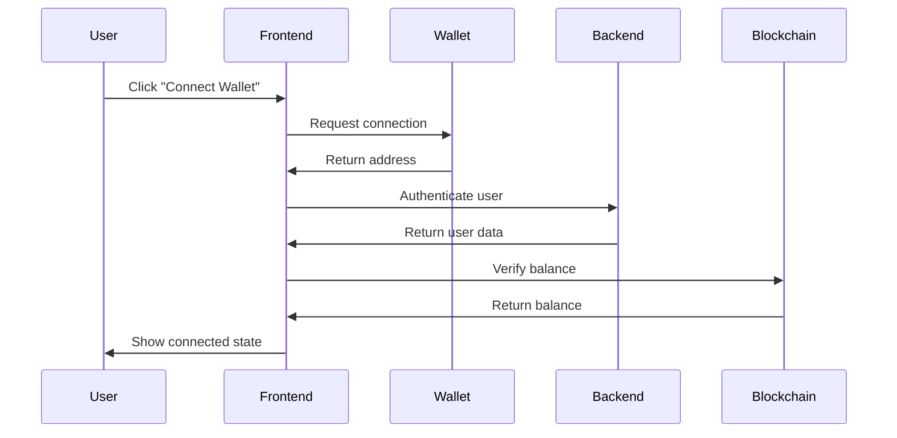
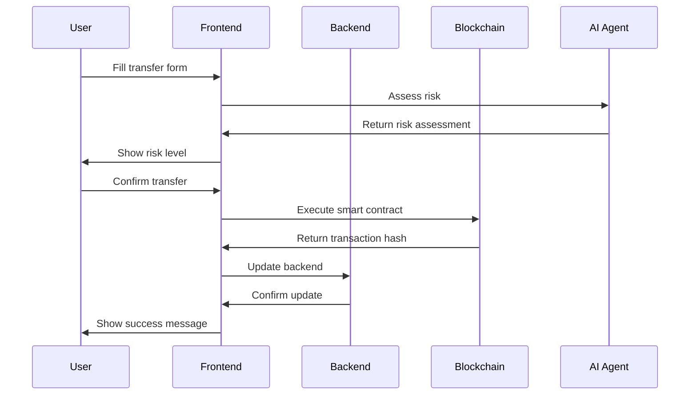
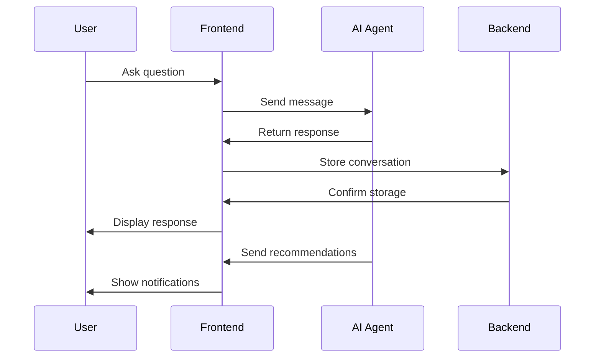

# 🚀 SeiMoney Frontend Integration Guide

## 📋 **Overview**

This guide covers the complete integration of SeiMoney frontend with:

- **Backend API** - Core services and database
- **Blockchain** - Sei Network smart contracts
- **AI Agent** - Intelligent recommendations and analysis
- **Discord Bot** - Social platform integration
- **Telegram Bot** - Messaging platform integration
- **Wallet Integration** - Keplr and Leap wallet support

## 🏗️ **Architecture**

```
┌─────────────────┐    ┌─────────────────┐    ┌─────────────────┐
│   Frontend      │    │   Backend       │    │   Blockchain    │
│   (React)       │◄──►│   (Node.js)     │◄──►│   (Sei Network) │
└─────────────────┘    └─────────────────┘    └─────────────────┘
         │                       │                       │
         │                       │                       │
         ▼                       ▼                       ▼
┌─────────────────┐    ┌─────────────────┐    ┌─────────────────┐
│   AI Agent      │    │   Discord Bot   │    │   Telegram Bot  │
│   Service       │    │   Service       │    │   Service       │
└─────────────────┘    └─────────────────┘    └─────────────────┘
```

## 🔧 **Setup & Configuration**

### 1. Environment Variables

Create a `.env` file in the frontend directory:

```bash
# API Configuration
VITE_API_URL=http://localhost:3001
VITE_API_TIMEOUT=10000

# Blockchain Configuration
VITE_SEI_NETWORK=testnet
VITE_SEI_RPC_URL=https://rpc-testnet.sei.io
VITE_SEI_CHAIN_ID=atlantic-2

# AI Agent Configuration
VITE_AI_AGENT_URL=http://localhost:3002

# Bot Services
VITE_DISCORD_BOT_URL=http://localhost:3004
VITE_TELEGRAM_BOT_URL=http://localhost:3005

# Feature Flags
VITE_ENABLE_AI_AGENT=true
VITE_ENABLE_DISCORD_BOT=true
VITE_ENABLE_TELEGRAM_BOT=true
VITE_ENABLE_BLOCKCHAIN_INTEGRATION=true
```

### 2. Install Dependencies

```bash
npm install
# or
yarn install
```

### 3. Start Development Server

```bash
npm run dev
# or
yarn dev
```

## 🔌 **Integration Components**

### 1. **AppContext** - State Management

The main context provider that manages:

- User authentication and wallet connection
- Data synchronization with backend
- Real-time updates and notifications
- AI agent and bot service connections

```typescript
import { useApp } from "../contexts/AppContext";

function MyComponent() {
  const { state, actions } = useApp();

  // Access state
  const { user, wallet, transfers } = state;

  // Use actions
  const handleConnect = () => actions.connectWallet("keplr");
  const handleCreateTransfer = (data) => actions.createTransfer(data);
}
```

### 2. **API Service** - Backend Communication

Handles all HTTP requests to the backend:

```typescript
import { apiService } from "../lib/api";

// Get user data
const user = await apiService.getUserProfile();

// Create transfer
const transfer = await apiService.createTransfer({
  recipient: "sei1...",
  amount: 100,
  expiry: Date.now() + 86400000,
  remark: "Payment for services",
});
```

### 3. **Blockchain Integration** - Smart Contract Interaction

Direct interaction with Sei Network smart contracts:

```typescript
import { seiClient, contractMessages } from "../lib/blockchain";

// Connect wallet
await seiClient.connectWallet(mnemonic);

// Execute smart contract
const txHash = await seiClient.executeContract(
  CONTRACT_ADDRESSES.payments,
  contractMessages.payments.createTransfer(recipient, amount, expiry, remark)
);

// Query contract
const transfers = await seiClient.queryContract(
  CONTRACT_ADDRESSES.payments,
  contractMessages.payments.listTransfers(address)
);
```

### 4. **AI Agent Service** - Intelligent Features

AI-powered recommendations and analysis:

```typescript
import { aiAgentService } from "../lib/aiAgent";

// Connect to AI agent
await aiAgentService.connect();

// Get portfolio analysis
const analysis = await aiAgentService.analyzePortfolio(portfolioData);

// Get trading signals
const signals = await aiAgentService.getTradingSignals(["SEI", "ATOM"]);

// Chat with AI
const response = await aiAgentService.chat("How can I optimize my portfolio?");
```

### 5. **Bot Services** - Social Platform Integration

Discord and Telegram bot integration:

```typescript
import { botService } from "../lib/bots";

// Connect to bot service
await botService.connect();

// Get available commands
const commands = await botService.getCommands("discord");

// Execute command
const result = await botService.executeCommand(
  "discord",
  "balance",
  [],
  userId,
  channelId
);

// Send notification
await botService.sendNotification({
  userId,
  platform: "discord",
  channelId,
  type: "alert",
  title: "Price Alert",
  message: "SEI price has increased by 5%",
  priority: "medium",
});
```

## 📱 **User Experience Flow**

### 1. **Wallet Connection**



### 2. **Creating a Transfer**



### 3. **AI Agent Interaction**



## 🧪 **Testing Integration**

### 1. **Unit Tests**

```bash
npm run test
# or
yarn test
```

### 2. **Integration Tests**

```bash
npm run test:integration
# or
yarn test:integration
```

### 3. **E2E Tests**

```bash
npm run test:e2e
# or
yarn test:e2e
```

## 🚨 **Error Handling**

### 1. **API Errors**

```typescript
try {
  const result = await apiService.createTransfer(data);
} catch (error) {
  if (error instanceof ApiError) {
    // Handle specific API errors
    switch (error.status) {
      case 400:
        // Bad request
        break;
      case 401:
        // Unauthorized
        break;
      case 500:
        // Server error
        break;
    }
  }
}
```

### 2. **Blockchain Errors**

```typescript
try {
  const txHash = await seiClient.executeContract(address, message);
} catch (error) {
  if (error.message.includes("insufficient funds")) {
    // Handle insufficient funds
  } else if (error.message.includes("gas limit")) {
    // Handle gas limit issues
  }
}
```

### 3. **Wallet Errors**

```typescript
try {
  await actions.connectWallet("keplr");
} catch (error) {
  if (error.message.includes("not installed")) {
    // Prompt user to install Keplr
  } else if (error.message.includes("user rejected")) {
    // Handle user rejection
  }
}
```

## 📊 **Monitoring & Analytics**

### 1. **Integration Status Dashboard**

Real-time monitoring of all services:

```typescript
import { IntegrationStatus } from '../components/ui/IntegrationStatus';

function Dashboard() {
  return (
    <div>
      <IntegrationStatus onRefresh={handleRefresh} />
    </div>
  );
}
```

### 2. **Performance Metrics**

- API response times
- Blockchain transaction success rates
- AI agent response quality
- Bot service uptime

### 3. **Error Tracking**

- Failed API calls
- Blockchain transaction failures
- Wallet connection issues
- Service downtime

## 🔒 **Security Considerations**

### 1. **Wallet Security**

- Never store private keys in frontend
- Use secure wallet connection methods
- Implement proper session management

### 2. **API Security**

- Use HTTPS for all API calls
- Implement proper authentication
- Validate all user inputs

### 3. **Blockchain Security**

- Verify contract addresses
- Validate transaction parameters
- Implement proper error handling

## 🚀 **Deployment**

### 1. **Build for Production**

```bash
npm run build
# or
yarn build
```

### 2. **Environment Configuration**

Ensure all environment variables are set for production:

```bash
VITE_API_URL=https://api.seimoney.com
VITE_SEI_NETWORK=mainnet
VITE_SEI_RPC_URL=https://rpc.sei.io
```

### 3. **Deploy to Hosting**

```bash
# Deploy to Vercel
vercel --prod

# Deploy to Netlify
netlify deploy --prod

# Deploy to AWS S3
aws s3 sync dist/ s3://your-bucket-name
```

## 📚 **Additional Resources**

- [Sei Network Documentation](https://docs.sei.io/)
- [CosmJS Documentation](https://cosmos.github.io/cosm-js/)
- [React Documentation](https://reactjs.org/docs/)
- [TypeScript Documentation](https://www.typescriptlang.org/docs/)

## 🤝 **Support**

For integration support:

- Check the [Issues](https://github.com/your-repo/issues) page
- Review the [Documentation](https://docs.seimoney.com/)
- Contact the development team

---

**Last Updated:** December 2024  
**Version:** 1.0.0
