# 🤖 SeiMoney MCP Agents

[](https://opensource.org/licenses/MIT)
[](https://nodejs.org/)
[](https://www.typescriptlang.org/)
[](https://sei.io/)

> **Enterprise-grade AI agents with Model Context Protocol (MCP) integration for automated DeFi operations on Sei Network**

## 🏗️ System Architecture

```mermaid
graph TB
    subgraph "MCP Agents Ecosystem"
        MCP[🧰 MCP Server<br/>Port 7100]
        RISK[🛡️ Risk Agent<br/>Port 7001]
        SCHED[⏰ Scheduler Agent<br/>Port 7002]
        REBAL[📈 Rebalancer Agent<br/>Port 7003]
    end
    
    subgraph "External Systems"
        SEI[Sei Network]
        ORACLES[Price Oracles]
        INDEXER[Blockchain Indexer]
    end
    
    subgraph "Core Services"
        API[API Gateway]
        CONTRACTS[Smart Contracts]
    end
    
    MCP --> RISK
    MCP --> SCHED
    MCP --> REBAL
    
    RISK --> SEI
    SCHED --> SEI
    REBAL --> SEI
    
    RISK --> ORACLES
    SCHED --> ORACLES
    REBAL --> ORACLES
    
    MCP --> API
    API --> CONTRACTS
    CONTRACTS --> SEI
```



### 🧩 Agent Components

| Agent | Purpose | Key Features | Port |
|-------|---------|--------------|------|
| **🛡️ Risk Agent** | Transaction risk assessment | Real-time scoring, fraud detection, compliance | 7001 |
| **⏰ Scheduler Agent** | Gas-optimized execution timing | MEV protection, cost optimization, queue management | 7002 |
| **📈 Rebalancer Agent** | Portfolio optimization | Multi-model strategies, risk-adjusted returns | 7003 |
| **🧰 MCP Server** | External tool integration | Wallet monitoring, analytics, simulations | 7100 |

## 🚀 Quick Start

### Prerequisites
- Node.js 18+
- pnpm package manager
- Sei Network access

### Installation & Setup

```bash
# Clone and install dependencies
git clone <repository>
cd mcp-agents
pnpm install

# Environment configuration
cp .env.example .env
# Edit .env with your configuration

# Start all agents
pnpm run start:all
```

### Development Mode

```bash
# Start all agents in development mode with hot reload
pnpm run dev:all

# Or start individual agents
pnpm --filter risk-agent dev
pnpm --filter scheduler-agent dev  
pnpm --filter rebalancer-agent dev
pnpm --filter mcp-server dev
```

### Testing

```bash
# Run comprehensive test suite
node test-agents.js

# Individual agent tests
pnpm --filter risk-agent test
pnpm --filter scheduler-agent test
pnpm --filter rebalancer-agent test
pnpm --filter mcp-server test
```

## ⚙️ Configuration

### Environment Variables

```bash
# Blockchain Configuration
CHAIN_ID=sei-testnet-1
RPC_URL=https://rpc.testnet.sei.io
REST_URL=https://rest.testnet.sei.io

# Smart Contract Addresses
CONTRACT_PAYMENTS=sei1abc123...
CONTRACT_GROUPS=sei1def456...
CONTRACT_POTS=sei1ghi789...
CONTRACT_ALIAS=sei1jkl012...
CONTRACT_ESCROW=sei1mno345...
CONTRACT_VAULTS=sei1pqr678...

# Service Endpoints
API_URL=http://localhost:8080
ORACLES_URL=http://localhost:7070
INDEXER_URL=http://localhost:9090

# Security & Authentication
INTERNAL_SHARED_SECRET=your-secure-secret-key
AGENT_API_KEY=your-agent-api-key
```

### Agent Ports & Health Checks

| Service | URL | Health Check |
|---------|-----|--------------|
| Risk Agent | `http://localhost:7001` | `GET /health` |
| Scheduler Agent | `http://localhost:7002` | `GET /health` |
| Rebalancer Agent | `http://localhost:7003` | `GET /health` |
| MCP Server | `http://localhost:7100` | `GET /health` |

## 🛠️ MCP Tools Reference

### Available Tools

#### 📊 `watchWallet(address)`
Monitor real-time wallet activity and transaction patterns.

```typescript
// Example usage
const result = await mcpClient.call('watchWallet', {
  address: 'sei1abc123...'
});
```

#### 🪙 `trackMemeCoin(denom, timeframe?)`
Track meme coin price movements, flows, and holder analytics.

```typescript
const memeData = await mcpClient.call('trackMemeCoin', {
  denom: 'factory/sei1.../DOGE',
  timeframe: '24h'
});
```

#### 🖼️ `trackNftLifetime(collection, includeMetadata?)`
Comprehensive NFT collection lifecycle analytics.

```typescript
const nftAnalytics = await mcpClient.call('trackNftLifetime', {
  collection: 'sei-punks',
  includeMetadata: true
});
```

#### ⚖️ `rebalanceWhatIf(signals, model?)`
Portfolio rebalancing simulation with multiple optimization models.

```typescript
const simulation = await mcpClient.call('rebalanceWhatIf', {
  signals: {
    prices: { SEI: 0.45, USDC: 1.0 },
    apr: { Staking: 0.12, Lending: 0.08, LP: 0.15 },
    risk: 40
  },
  model: 'bandit'
});
```

## 📈 Performance Metrics

### Test Results (Latest Run)
```
📊 Test Results: 11 passed, 0 failed
🎉 All tests passed! MCP Agents are working correctly.

✅ Health Checks: 4/4 agents online
✅ Risk Scoring: 30ms average response time
✅ Schedule Planning: 45ms average response time  
✅ Rebalance Planning: 78ms average response time
✅ MCP Tools: 4/4 tools functional
```

### Optimization Models Performance

| Model | Confidence | Risk Score | Projected APR | Use Case |
|-------|------------|------------|---------------|----------|
| **Markowitz** | 75% | 38 | 12.37% | Risk-adjusted optimization |
| **Bandit** | 75% | 38 | 12.37% | Multi-armed exploration |
| **RL** | 55% | 35 | Variable | Reinforcement learning |
#
# 🔧 API Reference

### Risk Agent Endpoints

#### `POST /risk/score`
Evaluate transaction risk in real-time.

**Request:**
```json
{
  "from": "sei1abc123...",
  "to": "sei1def456...",
  "amount": { "denom": "usei", "amount": "50000000" },
  "action": "transfer",
  "context": { "txPerHour": "25", "txPerDay": "150" }
}
```

**Response:**
```json
{
  "score": 30,
  "reasons": ["unknown-address-format", "high-amount", "active-user"],
  "recommendation": "allow"
}
```

### Scheduler Agent Endpoints

#### `POST /schedule/plan`
Optimize transaction timing for gas efficiency.

**Request:**
```json
{
  "action": "harvest",
  "targetId": 123,
  "urgency": "normal",
  "gasCeiling": 100000
}
```

**Response:**
```json
{
  "request": { "action": "harvest", "targetId": 123 },
  "plan": { "etaSec": 60, "reason": "harvest-apr=0.100", "estimatedGas": 0.02 },
  "optimalTime": "2025-08-24T10:21:12.490Z"
}
```

### Rebalancer Agent Endpoints

#### `POST /rebalance/plan`
Generate portfolio optimization strategies.

**Request:**
```json
{
  "vaultId": 456,
  "signals": {
    "prices": { "SEI": 0.45, "USDC": 1.0, "ATOM": 8.2 },
    "apr": { "Staking": 0.12, "Lending": 0.08, "LP": 0.15 },
    "risk": 35
  },
  "model": "rl"
}
```

**Response:**
```json
{
  "plan": {
    "legs": [
      { "proto": "Staking", "target_bps": 2000 },
      { "proto": "Lending", "target_bps": 400 },
      { "proto": "LP", "target_bps": 3200 },
      { "proto": "PerpsHedge", "target_bps": 4400 }
    ],
    "totalBps": 10000,
    "confidence": 55,
    "model": "rl"
  }
}
```

## 🏛️ Architecture Patterns

### Event-Driven Design
- Asynchronous message processing
- Real-time data streaming
- Event sourcing for audit trails

### Microservices Architecture
- Independent agent deployment
- Service mesh communication
- Horizontal scaling capabilities

### Risk Management
- Multi-layer validation
- Circuit breaker patterns
- Graceful degradation

## 🔒 Security Features

- **Authentication**: API key-based access control
- **Encryption**: TLS 1.3 for all communications
- **Rate Limiting**: Configurable request throttling
- **Input Validation**: Comprehensive parameter sanitization
- **Audit Logging**: Complete transaction trail

## 📊 Monitoring & Observability

### Health Monitoring
All agents expose `/health` endpoints with:
- Service status
- Uptime metrics
- Resource utilization
- Dependency health

### Logging
Structured JSON logging with:
- Request/response tracking
- Performance metrics
- Error categorization
- Security events

## 🚀 Deployment

### Docker Deployment
```bash
# Build all agents
docker-compose build

# Start the stack
docker-compose up -d

# Scale individual services
docker-compose up --scale rebalancer-agent=3
```

### Production Considerations
- Load balancing across agent instances
- Database connection pooling
- Redis caching for frequently accessed data
- Prometheus metrics collection
- Grafana dashboards for monitoring

## 🤝 Contributing

1. Fork the repository
2. Create a feature branch (`git checkout -b feature/amazing-feature`)
3. Commit your changes (`git commit -m 'Add amazing feature'`)
4. Push to the branch (`git push origin feature/amazing-feature`)
5. Open a Pull Request

### Development Guidelines
- Follow TypeScript best practices
- Maintain test coverage above 80%
- Use conventional commit messages
- Update documentation for API changes

## 📄 License

This project is licensed under the MIT License - see the [LICENSE](LICENSE) file for details.

## 🆘 Support

- **Documentation**: [Full API Documentation](./docs/)
- **Issues**: [GitHub Issues](https://github.com/your-org/sei-money/issues)
- **Discord**: [Community Chat](https://discord.gg/sei-money)
- **Email**: support@sei-money.com

---

**Built with ❤️ for the Sei Network ecosystem**